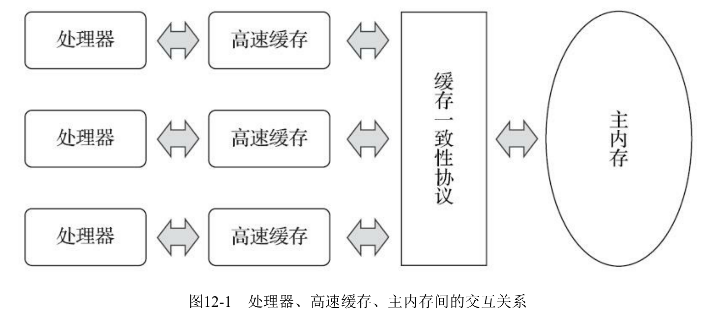
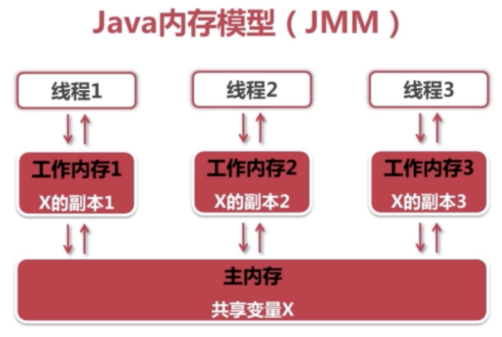
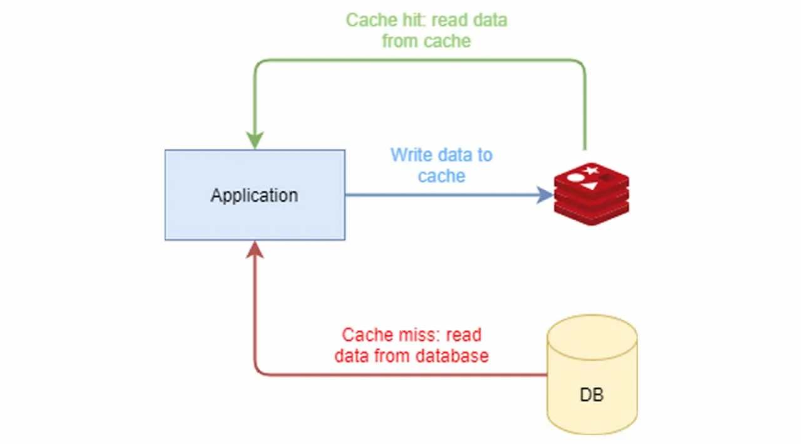

### 前言
知识的深度和广度一直是鱼和熊的关系，难以兼得。毫无疑问二者都相当重要，没有深度就难以印象深刻，没有广度，难免视野狭隘。但有一点是可以确认的，越是基础的东西，越是底层的东西，反而值得深挖。作为java并发编程的先驱，`synchronized` 是值得我们一探究竟的。
### 并发和锁
多线程之间进行通信主要是通过访问共享状态进行的。但这样会引入两个问题：
#### 多线程并发导致的冲突问题
最常见的场景就是`i++`问题，那么如何证明`i++`不是原子性的呢。一种简单的途径就是使用`javap`反编译成字节码。来看下面这段代码：
```java
public class SynchronizedDemoApplication {
    private static int i = 1;
    public static void main(String[] args) {
        i++;
    }
}
```
`javap`反编译的字节码如下：
```java
public class com.family.jdk.concurrent.SynchronizedDemoApplication {
  public com.family.jdk.concurrent.SynchronizedDemoApplication();
    Code:
       0: aload_0
       1: invokespecial #1                  // Method java/lang/Object."<init>":()V
       4: return

  public static void main(java.lang.String[]);
    Code:
       0: getstatic     #7                  // Field i:I 
       3: iconst_1
       4: iadd
       5: putstatic     #7                  // Field i:I
       8: return

  static {};
    Code:
       0: iconst_1
       1: putstatic     #7                  // Field i:I
       4: return
}
```
```java
0: getstatic    //获取静态共享变量i的值放入操作数栈顶
3: iconst_1     //将整数1推到栈顶
4: iadd         //将栈顶两int值相加并将结果压入栈顶
5: putstatic    //将栈顶的值同步回主存
```
可以看出一个`i++`操作翻译为jvm指令划分为了4步。其中每条jvm指令 JVM解释器还会运行多行代码解释执行或者即时编译器编译成多行本地机器码执行。但已经足够证明了`i++`不是一个原子操作了。试想如果多个线程同时调用类似下面这样的代码去操作计数器`i`，由于无法禁止多个线程的指令交替执行。那么最终的`i`的状态必然是混乱的。

```java
public void increment(){
  i++;
}
```

#### 内存一致性问题

**多核计算机内存模型**


>摘自【深入理解java虚拟机】

**java内存模型**



**高并发场景下的分布式缓存**



不管是哪种内存模型都会面临一个同样的问题，就是内存一致性问题。
而解决问题的办法就是同步。

* monitor enter
* monitor exit

### 内存可见性

### 实现原理

### this引用逃逸


## 参考资料
https://blog.csdn.net/tongdanping/article/details/79647337

https://tech.meituan.com/2018/11/15/java-lock.html

https://docs.oracle.com/javase/tutorial/essential/concurrency/sync.html

https://blog.csdn.net/yzh_1346983557/article/details/105227803

https://blog.csdn.net/zhaomengszu/article/details/80270696