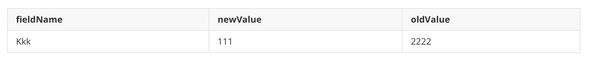
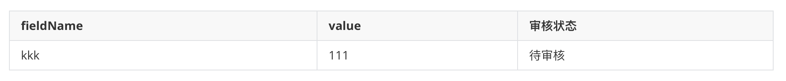
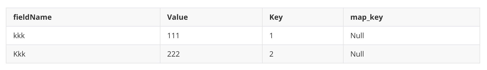
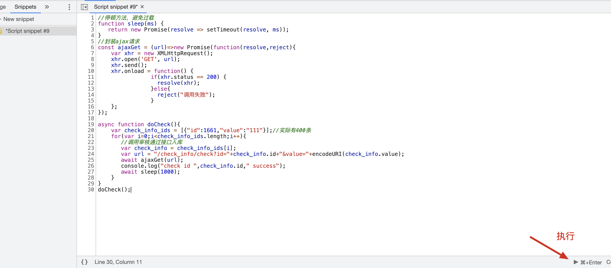

### 前言
刚入职新公司不久，运营妹子提了个需求，她整理了一份400条数据记录的excel，需要执行两步操作，一个是批量审核，一个是批量合并。后台界面都是可以操作的，但都没有批量功能。让我能不能写个脚本处理下。本着给新同事树立一个良好形象的目的，我欣然接受了这个需求。对于突如其来的需求，只能拿出自己多少年与产品运营不断交锋，攒下来的本事进行应对了，俗称见招拆招。

### 梳理要做的事情
首先对整个事情要弄清楚自己需要干什么，怎么干。运营给的是一份excel表格。里面是它整理的400条具有映射关系的数据格式形如：



第一件事情是有一张待审核记录表，姑且叫做`check_info`表吧，这张表里存放的是400条爬虫引入的待审核数据，对应的正是excel里的400条数据，形如：



需要将这400条数据，批量审核通过，界面是没有批量功能的。某条记录审核成功后，就会在另外一个表生成一条数据，加上之前旧的值已经存在一条数据，一共两条数据，这张表姑且叫作`field_detail`吧，形如：



`222`那条数据是`oldValue`对应的数据，`111`是上面审核通过新加的数据。

第二件要做的事情就是，执行下面这条语句：

```sql
update field_detail set map_key = 1 where fieldName='kkk' and key=2;
```

很简单，但是同样没有批量接口，另外这个接口做的事情不止执行这条语句这么简单，还做了许多和缓存清理，更新有关的事情。所以只能写脚本批量调用单条的接口。事情已经描述完了。下面就是开干了。

### 给出解决方案

单条审核的接口是`get`请求，形如：`/check_info/check?id=&value=xxx`，审核的接口使用`get`，有点奇怪呀。因为是根据`id`进行审核的，所以必须找出`excel`表里400条记录对应在`check_info`表的id。这个可以把excel记录转化为`select`语句，然后400条使用`union`连接一下。就可以把400条`id`找出来了。注意此处的参数里面还需要把`value`传给后台，因为这个接口的定义是可以在审核的时候修改自己重新定义的`value`，但是此处我们只要把原值传过去即可。找出来之后放到一个`json`数组里面，然后使用自己的身份登录到后台系统。按`F12`打开`chrome`的调试工具，在`sources`这个`tab`下新建一个`snippet`，这个里面就可以写js代码了。此处可以写个`for`循环，400条数据逐个`ajax`调用相应的接口。成功继续调用下一条，失败就中断循环。具体代码下面会贴出来。这样第一件事情就算完成了。第二件事情关键就是把`oldValue`和`newValue`的key找出来。因为单条的接口参数有三个分别是：`fieldName`，`oldKey`，`newKey`。此处还是使用`sql`处理。思路就是将新的和老的合并成一条记录，属性有`fieldName`，`oldKey`，`newKey`，然后将400条记录再`union`起来。并将查询结果导出成`json`格式。同样使用类似第一步的方式逐个调用接口。

### 详细过程

首先根据运营提供的excel找出待审核的`id`，这个用excel的`CONCATENATE`函数很灵。形如：

```
=CONCATENATE("select id,value from check_info where fieldName= B2 and value= C2 union")
```

B2表示取第二行第二列，C2表示取第二行第三列。最后将`sql`拼接起来，就可以将待审核的记录的`id`和`value`从线上库里捞出来。庆幸就400条，因为`DMS`限制单次查询不大于500条。将查询的数据导出成`json`格式。

开始写批量请求的脚本：



庆幸400条都显示执行成功了。当然因为是直接操作线上环境，开始不要批量跑，弄几条试试是很有必要的。然后是检查处理结果，但是不幸的是出问题了。按道理使用形如下面的sql语句检查，结果应该是400条数据：

```sql
select * from field_detail where fieldName=kkk and value = 111 union 
...
```

但是结果就395条，为什么少了5条呢？通过一些`sql`我找出了缺失的那5条。发给了运营。询问她这几条数据是不是有什么问题。因为我自信的以为我的操作是没问题的。一定是运营给的数据有问题。运营妹子也不赖，迅速找出了这几条的规律。`value`的内容都包含了`+`号。实际这几条数据已经进入了`field_detail`，只不过`+`号变成了空格。此时我立马知道问题出在哪了。请求参数被我`encodeURI`处理过了。其实在上家公司遇到过这种情况。也是自己不够重视，"二进宫"了。运营妹子爽快的说她自己改下就可以了。就5条嘛。但此时我的心里是有点自责的。同样的坑踩了两次，实属不应该啊。那我来解释下为什么`+`号会变成空格吧。

`RFC-2396`这个标准定义了URI中`+`号为保留字符，`encodeURI`不会对保留字符进行编码。比如：

```javascript
encodeURI("国+家");
//%E5%9B%BD+%E5%AE%B6
```

而加号这个保留字符的含义就是空格。所以传入后端会变成空格。要解决这个问题有两个方案，一是将`value`放到`payload`中。改成`post`请求，当然当前这个场景肯定是不行的。第二个方案就是使用`encodeURIComponent`，这个函数会对保留字符进行编码，比如：

```javascript
encodeURIComponent("国+家");
//%E5%9B%BD%2B%E5%AE%B6
```

`+`号变成了`%2B`。这样传入后端还会解码为`+`号了。

关于百分号编码详细解释请参考：http://www.lmwlove.com/ac/id1030

就这样第一步算蒙混过关了，接下来需要进行批量合并了。首先还是把需要传入的参数使用`sql`查询处理，处理的`sql`形如：

```sql
select `fieldName`,(select `key` from field_detail where fieldName = 'kkk' and value = '111') as newKey,`key` as oldKey from field_detail where  fieldName = 'kkk' and value = '222' union
...
```

批量合并的脚本，形如：

```javascript
//停顿方法，避免过载
function sleep(ms) {
   return new Promise(resolve => setTimeout(resolve, ms));
}
//封装ajax请求
const ajaxGet = (url)=>new Promise(function(resolve,reject){
    var xhr = new XMLHttpRequest();
    xhr.open('GET', url);
    xhr.send();
    xhr.onload = function() {
                if(xhr.status == 200) {
                  resolve(xhr);
                }else{
                  reject("调用失败");
                }
    };
});

async function doMerge(){
    var mergeParamArray = [{"fieldName":"kkk","newKey":123,"oldKey":456}];//实际有400条
    for(var i=0;i< mergeParamArray.length;i++){
       //调用合并接口
       var mergeParam = mergeParamArray[i];
       var url = "/field_detail/merge?field="+mergeParam.fieldName+"&oldKey="+mergeParam.oldKey+"&newKey="+mergeParam.newKey;
       await ajaxGet(url);
       console.log("merge field ",JSON.stringify(mergeParam)," success");
       await sleep(1000);
    }
}

doMerge();
```

庆幸400条都成功了。运营妹子表示了感谢。

### 总结与反思

上面这种案例只能解一时之需，真正科学的办法还是添加功能。满足日常运营需求。整个过程下来，也许是自己确实做过许多类似的事情吧，几乎没有什么卡顿。但是有几个地方还是做得不够好，比如上面那个百分号编码问题，还有整个过程自己和运营确认的环节也没做好。理论上这种需求都需要自己执行一步，运营确认一步。如果运营确认的时候不够仔细，自己也需要把关键信息传递给她。表明自己执行完当某个操作执行，效果是什么样的。还有一点也是要值得考虑的，毕竟是批量调用接口，难保某次调用有问题，导致整个执行中断。此时需要记录下当前的进度。找出出错的是哪条记录，便于下次恢复执行。还有一点也很关键，就是假设执行过程中发现问题了，为了及时止损，需要中断任务执行。此时可以考虑强制关闭当前标签页。这样`for`循环的`js`也会终止执行。总之胆子要大，但心要细。
