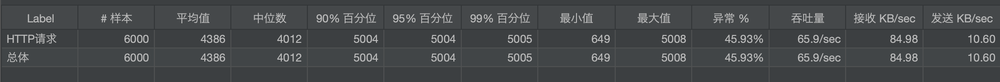
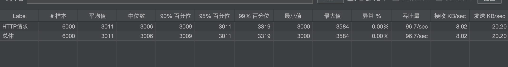
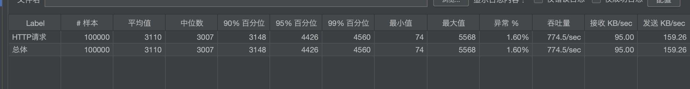
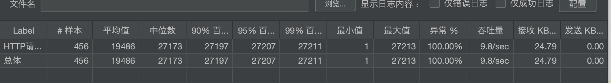
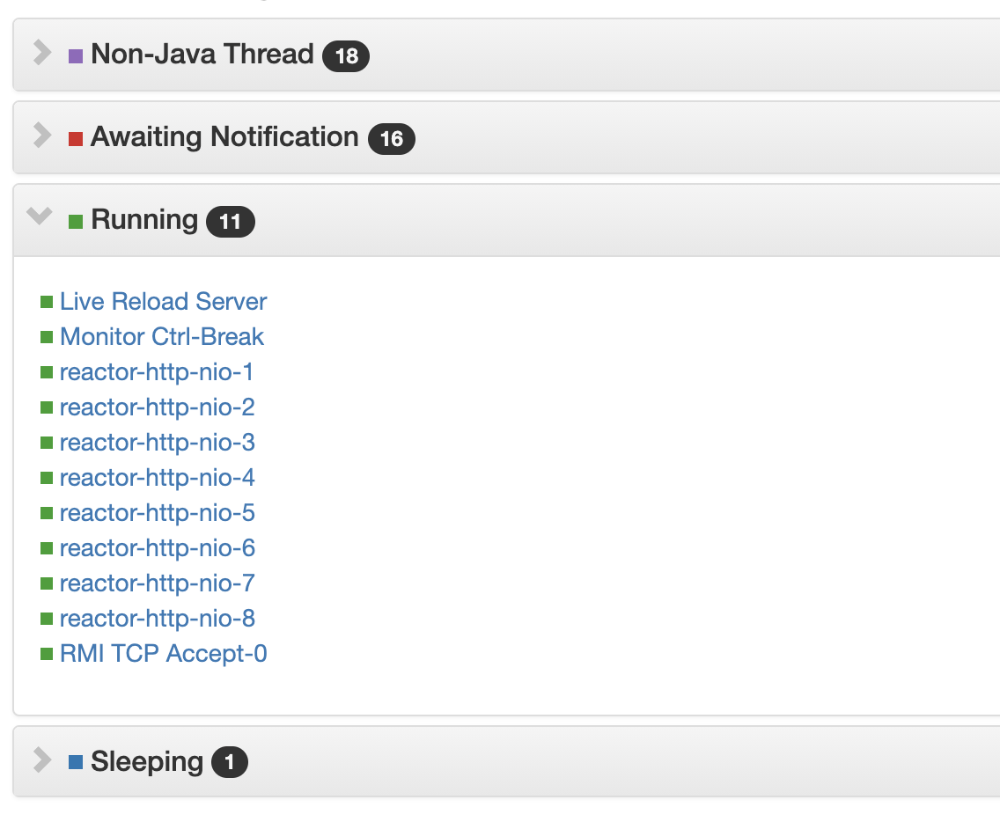

### mvc vs webflux

#### 场景1
* `sprin mvc` `tomcat9.0` `jmeter`

* 使用LockSupport.park模拟一个阻塞3秒的请求,使用300个线程同时发送请求
* 设置http响应超时时间为5秒

下面是测试结果



出现了大量的异常请求，200个 工作线程大部分都是`TIMED_WAITING`的状态

#### 场景2

* `spring webflux` `netty4.1` `jmeter`
* 使用 Mono的delayElement模拟延迟3秒，分别使用300个线程和2500个线程同时发送请求
* 设置http响应超时时间为5秒

300个线程的情况下：无异常请求，吞吐量略有提升



2500个线程的情况下：有少量异常,但吞吐量明显提高很多



#### 场景3
* `spring webflux` `netty4.1` `jmeter`
* 使用LockSupport.park模拟一个阻塞3秒的请求,使用300个线程同时发送请求
* 设置http响应超时时间为5秒

几乎都是异常的



#### 结论

* 使用webflux明显应用的吞吐量大幅度提升，应用的可伸缩性更好
* 对于响应时间，两者没有区别，使用webflux并不能让应用响应更快。
* 使用web flux,但是仍然使用阻塞式的写法，程序也会退化为原来的性能

###  函数式编程

纯函数（Pure functions）函数复合（Function composition）避免共享状态（Avoid shared state）避免改变状态（Avoid mutating state）避免副作用（Avoid side effects）

* 纯函数：如果传入的参数是一样的，那么函数返回同样的结果，它不依赖于任何状态数据，仅仅依赖传入的参数，以此来达到减少副作用的目的
* 函数组合 [Function composition](https://www.cs.utah.edu/~germain/PPS/Topics/composition.html)
* 链式调用[method chain](https://en.wikipedia.org/wiki/Method_chaining)  [method cascading](https://en.wikipedia.org/wiki/Method_cascading)  [Fluent interface](https://en.wikipedia.org/wiki/Fluent_interface) `promise`  `builder`  `lodash chain` `java8 stream` `mock` `jpa Specifications` 设计目的：提高代码的可读性
* 声明式编程思想：只关注做什么而不是怎么做。声明式的问题就是隐藏了执行细节。命令式编程思想：关注计算机执行的步骤，即一步一步告诉计算机先做什么再做什么。
* 增加了代码的可读性，方便代码的管理和重构，便于测试
* 带来的问题：debug不友好。
### 响应式编程

#### 历史

其最早是由微软提出并引入到 .NET 平台中，随后 ES6 也引入了类似的技术。在 Java 平台上，较早采用反应式编程技术的是 Netflix 公司开源的 RxJava 框架

#### reactive-streams-jvm

定义了每个顶层接口的含义

英文原文：https://github.com/reactive-streams/reactive-streams-jvm
中文翻译：https://blog.csdn.net/u011179993/article/details/102766416

##### 背压
背压的含义就是指在一个典型的生产者消费者模型下，**生产者生产数据的速度超过了消费者消费的速度导致的问题**。
前端场景下，点击按钮产生的事件相当于生产数据，事件的处理函数相当于消费者，如果用户lodash的throttle函数包装一下处理函数，当点击过快，就可以进行有损背压控制（直接丢弃掉部分事件）

### project reactor

#### 他的核心设计思想
* 观察者模式 `Observer`
* 发布订阅模式`publisher` `subscriber`
* 与迭代器模式不同点是，迭代器设计思想是拉取，`next()`直接得到下一个元素，是命令式的，而响应式的的核心是推送`onNext(item)`发射下一个元素

#### 为什么使用它
阻塞式的带来了资源的浪费，可以使用异步来解决问题，一种方式是回调，一种方式是Future
* 回调地狱/回调嵌套，比如说ajax的callback
* future 异步计算结果,
  * 其在组合方面做得不够好。
  * 多个future的时候还需要我们额外写代码。
  * 不支持延迟计算
  * 缺乏对错误处理的支持

#### project reactor是怎么做的
* 大量使用组合，避免嵌套
* 流水线作业
* 在订阅之前什么也不会发生
* 每一次操作都是将publisher包装成一个新的publisher，直到交给消费者
* 对背压的支持

#### Flux/Mono

##### 延迟计算Mono#delayElement

```java
Mono<String> mono = Mono.just("SUCCESS").delayElement(Duration.ofSeconds(3)).map(String::toLowerCase);
mono.subscribe((str) -> {
    System.out.println("thread:" + Thread.currentThread().getName() + " element:" + str);
});
LockSupport.park();
```

1. `Mono#just`返回`MonoJust`,`Mono#delayElement`返回`MonoDelayElement`,`Mono#map`返回`MonoMap`
2. 首先订阅方法触发执行
3. 将`subscriber`包装成`FluxMap.MapSubscriber`
4. 将`FluxMap.MapSubscriber`包装成`MonoDelayElement.DelayElementSubscriber`
5. 执行`MonoJust`的`subscribe`方法开始订阅
6. 调用`MonoDelayElement.DelayElementSubscriber` 的`onSubscribe`通知订阅
7. 其中`onSubscribe`做了两件事
	* 调用`FluxMap.MapSubscriber`的`onSubscribe`通知订阅
	* 调用`ScalarSubscription`的`request`请求发布事件
8. `request`方法调用`MonoDelayElement.DelayElementSubscriber`的`onNext`方法进行事件通知
9. `onNext`方法调用scheduler生成一个延迟任务，到点执行`FluxMap.MapSubscriber`的`onNext`和`onComplete`方法
10. `FluxMap.MapSubscriber`调用原始的subscriber的`onNext`方法进行事件通知

### webflux工作流程
#### 测试时webflux项目线程的工作情况

#### 流程分析

1. 将断点设在`AbstractChannelHandlerContext#invokeWrite0`真正往客户端写数据的地方
1. 首先是netty的`NioEventLoop(reactor-http-nio线程)`读取请求
2. 调用`ChannelOperations#onInboundNext`处理请求
3. `ConnectionObserver`监听状态变化，内部调用的是`HttpServer.HttpServerHandle#onStateChange`处理状态变化
4. `onStateChange` 执行`publisher`的`subscribe`方法触发订阅
6. 切换到`Schedulers.parallel`线程进行事件通知
7. 执行了`HttpOperations` 的`send`方法，内部调用netty的`pipeline`进行写操作
8. 再次切换到`NioEventLoop`工作线程进行异步写

###  reactor生态
* WebClient 反应式Web客户端
* R2dbc 反应式的简单的orm框架，支持声明式事务
* ReactiveRedis 需要使用Lettuce
* Web flux
* Netty

### 总结

* 任何技术都是有特定使用场景的`project reactor`也不例外，当并发量比较低的情况下，他的优势体现不出来，相反增加了代码的复杂性。
* 当然对于高并发的场景，阻塞式应用也可以通过增加实例个数来进行扩展，提高服务的吞吐量。
* 但对于访问量弹性很大的接口，把它剥离出来，使用响应式编程不失为一个不错的选择。主要是避免了资源的浪费。
* `project reactor`借鉴了函数式编程的思想，提高了代码的可读性
* 响应式编程适合IO密集型应用，IO 密集型包括：磁盘IO密集型, 网络IO密集型，微服务网关就属于网络 IO 密集型，使用异步非阻塞式编程模型，能够显著地提升网关对下游服务转发的吞吐量。
* 当下游的能力比自己差的时候没必要用响应式编程
* 对研发的编码能要求更高