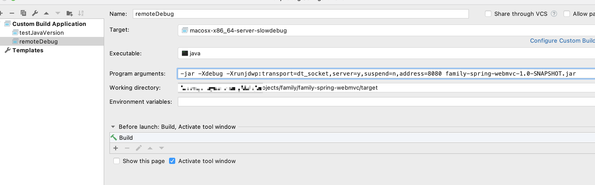
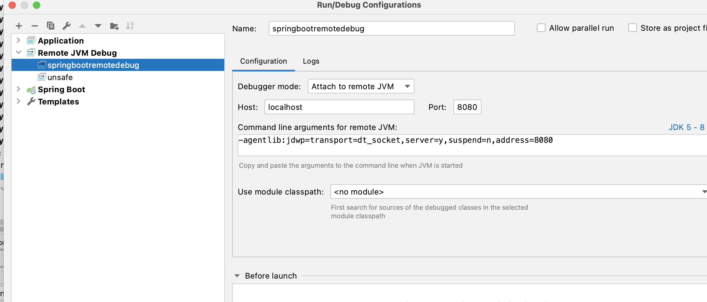

### 前言

我们都知道java程序是运行在jvm虚拟机上的，jdk里面很多native方法的实现都是在jvm源码里面的。那么jvm是如何加载类，如何创建对象，线程同步的本质是什么？那些看不见的native方法到底干了什么？这些疑问使用`baidu`或许能了解个大概。但通过百度获取的知识，如果自己没有消化，只是临时解决某个问题，或者面试的时候背诵一下。我想这是无意义的。因为过了一段时间后，你会忘了它。甚至一点印象都没有了。那么怎么把这些知识深深的刻在脑海里呢。其实我觉得没必要。为什么要记住这些死板的知识点呢。举个例子，面试的时候面试官可能会问你java nio底层依赖的epoll机制一共有涉及几个系统调用。答案是`epoll_create`，`epoll_ctl`，`epoll_wait`这三个。但真的有必要记住他们吗。我想也就大概面试的时候会用到吧。而且还是面试一般开发岗位的时候会问到。其实找下jdk源码不就知道了，没必要刻意记住这些东西。接下来我会使用几篇文章讲解如何搭建本地jvm的调试环境，如何调试`native`方法。如何调试jvm启动过程。当然这些只是打开jvm大门的钥匙。要想深入理解还需要一点一滴的积累。

### 环境准备

我的操作系统：`mac os Big Sur 版本11.4`

1.  下载`clion`，我的版本是`2019.3.6`
2.  `git clone openjdk12`
3.  安装jdk11，编译jdk12需要使用引导的jdk，否则会提示`Your Boot JDK version must be one of 11,12`

### 编译jdk

进入openjdk的根目录执行

```shell
bash configure --disable-warnings-as-errors --with-debug-level=slowdebug --with-jvm-variants=server
make images
# disable-warnings-as-errors选项是禁止把warning 当成error
# --with-debug-level=slowdebug。用来设置编译的级别，可选值为release、fastdebug、slowde-bug，越往后进行的优化措施就越少，带的调试信息就越多。默认值为release。slowdebug 含有最丰富的调试信息，没有这些信息，很多执行可能被优化掉，我们单步执行时，可能看不到一些变量的值。所以最好指定slowdebug 为编译级别。
# with-jvm-variants 编译特定模式的HotSpot虚拟机，可选值：server、client、minimal、core、zero、custom
```

configure 命令承担了`依赖项检查`、`参数配置`和`构建输出目录结构`等多项职责，如果编译过程中需要的工具链或者依赖项有缺失，命令执行后会得到明确的提示，并给出该依赖的安装命令。

漫长的等待之后，一个自己的jdk诞生了。它的目录结构是这个样子的


### 使用clion调试hotspot虚拟机

下面的操作主要参考这篇博客https://blog.jetbrains.com/clion/2020/03/openjdk-with-clion/

[compilation database](https://www.jetbrains.com/help/clion/compilation-database.html) 这个功能大概的意思就是`clion`默认是用`cmake`，但是编译`openjdk`是用`make`，可以通过下面这个办法解决

> If you are working with a project which is not based on [CMake](https://www.jetbrains.com/help/clion/quick-cmake-tutorial.html), [Gradle](https://www.jetbrains.com/help/clion/gradle-support.html), or [Makefiles](https://www.jetbrains.com/help/clion/makefiles-support.html), you can still benefit from the advanced IDE features that CLion provides. One way is to [import](https://www.jetbrains.com/help/clion/creating-new-project-from-scratch.html#import-prj) a non-CMake project and let CLion convert it into a simple CMake structure. Another option is to open a project by loading its **compilation database**

生成`compile_commands.json`文件

```shell
make compile-commands
```

使用CLion File=> Open => 选择文件

`/jdk12/build/macosx-x86_64-server-slowdebug/compile_commands.json`

选择`open as Project`

这时候，你会发现你是看不到源码的，所以下面需要修改项目的根目录，通过`Tools -> Compilation Database -> Change Project Root`功能，选中你的源码目录，也就是`jdk12`

##### Custom Build Targets


##### Run/Debug configurations


设置断点，进行debug


此处只是简单地演示了`java -version`如何debug。那如果是一个普通的java程序如何debug呢。

写一个测试程序如下：

```java
public class Demo {
    public static void main(String[] args) throws Exception {
        LockSupport.park();
    }
}
```

查看源码发现park方法实际调用的是`Unsafe`类的park方法。而这个`native`方法的源代码位于`/jdk12/src/hotspot/share/runtime/park.hpp`下，它的实现类是`/jdk12/src/hotspot/os/posix/os_posix.cpp`。配置调试程序的参数。


在`os_posix.cpp`中设置断点。


可以看出最终调用`pthread_cond_wait`这个系统调用，线程等待在那里。

这只是一个简单的例子演示了如何使用`Clion`调试java程序。按照这个方法就可以对任何`native`方法进行单步调试。

### IDEA配合Clion远程调试

上面我们实现了调试hotspot虚拟机。如果我想java程序和hotspot虚拟机一起调试，该如何实现呢？这就需要使用到jvm的远程debug功能了。

比如新建一个简单的spring boot项目，使用maven生成可执行的jar包。

clion配置如下：



idea配置如下：



这样不论是在clion下设置断点还是在idea下设置断点，都可以进行单步调试啦。

### 总结
这篇文章简单介绍了下调试openjdk的环境和工具的使用。后面会出几期针对特点知识点的深入hotspot源码的解析教程。敬请期待。