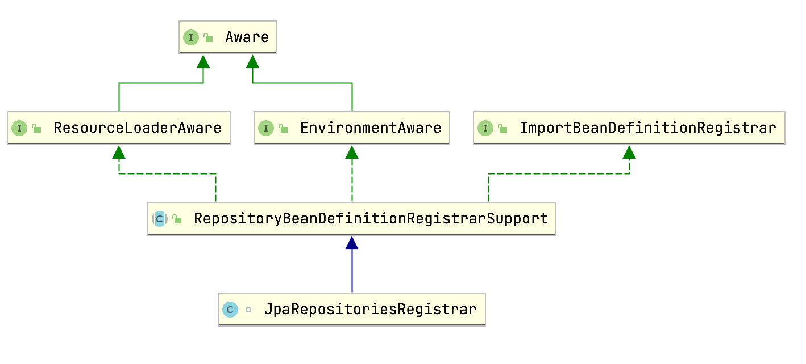
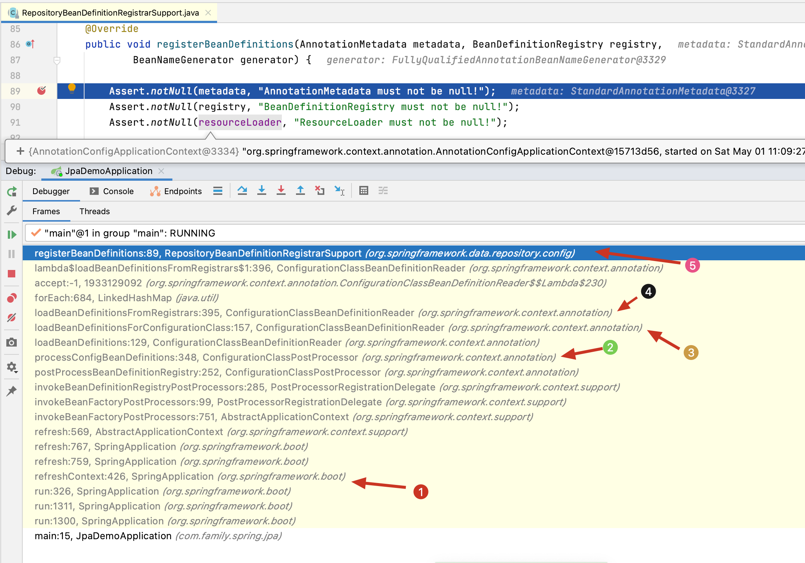
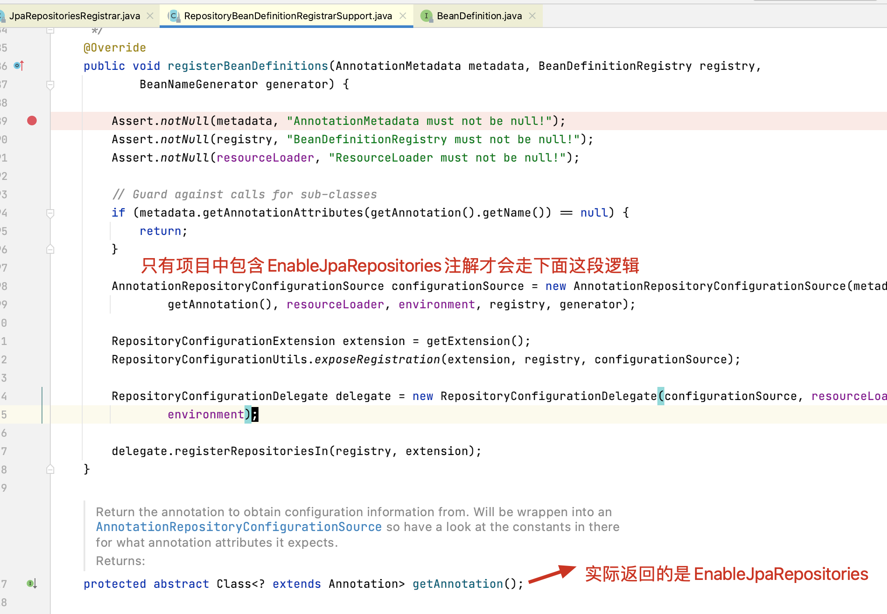
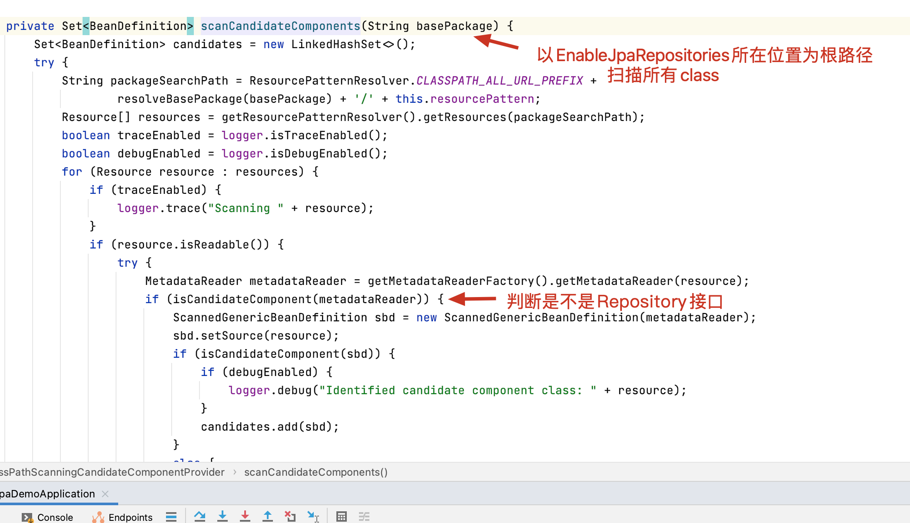
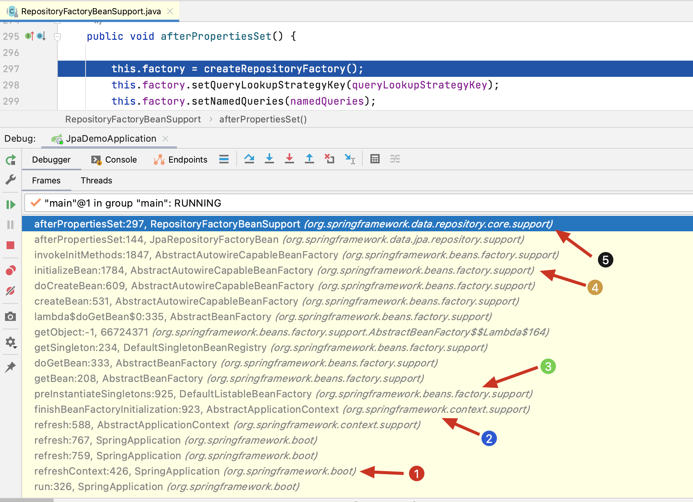

### 前言

在使用`spring-data-jpa`对于dao层或者叫做数据仓库层，我们只需要定一个简单的repository接口，就能完成一些基本的curd操作。但本质上spring帮我们做了很多事情。

### 学习spring-data-jpa原理的收益

* 有助于我们理解`spring-data-jpa`，使用起来更加得心应手。
* 学习spring的设计模式，有助于日志业务中间件的开发。

### EnableJpaRepositories
这是一个开启Srping JPA的代码配置的注解。这个套路在spring里面已经司空见惯。
#### 常用属性
* `basePackages`/`basePackageClasses` 指定扫描repository 的包路径
* `repositoryBaseClass` 指定repository的基类，默认是`SimpleJpaRepository`哦。

### registerBeanDefinitions
打开注解 `@EnableJpaRepositories`的源码发现，它的核心是导入了一个`JpaRepositoriesRegistrar`(jpa仓库登记员)的类。


可以看出这个登记员的核心方法是`registerBeanDefinitions`，我们在该方法里面设置一个断点。看下方法的调用栈信息。



1. 发生在`refreshContext`阶段
2. 使用的是`ConfigurationClassPostProcessor`进行处理的。
3. 通过`@Configuration`注解加载`BeanDefinition`
4. 通过登记员加载`BeanDefinition`
5. 名叫`Jpa Repository`的登记员登记`BeanDefinition` 当然实际的逻辑是它的支撑类在执行。

找到了口子之后，我们再来详细地分析下registerBeanDefinitions的源代码。由于贴图比较占篇幅，这段过程就以文字描述为主了。请读者对照下spring源码。
1. 首先有个最基础的判断，只有使用`EnableJpaRepositories`注解，才会执行注册数据仓库的逻辑。
   
1. 接着构建一个数据仓库配置代表`RepositoryConfigurationDelegate` 构建过程的关键信息就是填充了一个默认数据仓库配置类`DefaultRepositoryConfiguration`，这个是类是每个repository一个，找repository的方式很粗暴，

   

2. 然后代表执行`registerRepositoriesIn`将`BeanDefinition`注册到注册中心。
```java
delegate.registerRepositoriesIn(registry, extension);
```
3. 方法内部，使用`RepositoryBeanDefinitionBuilder` 依据`DefaultRepositoryConfiguration`创建，注意此时创建的`BeanDefinition`的beanClass是`org.springframework.data.jpa.repository.support.JpaRepositoryFactoryBean`
4. 到此完成了repository的`BeanDefinition`的注册。那啥时候创建repository的呢。答案就藏在`JpaRepositoryFactoryBean`的`afterPropertiesSet`方法里。同样`afterPropertiesSet`逻辑也是由支撑类`RepositoryFactoryBeanSupport` （和`JpaRepositoryFactoryBean`是父子关系）实现的。
### Create Repository
我们将断点设置在这个方法里，来看下它的调用栈。
1. 仍然发生在刷新`ApplicationContext` 中
2. 初始化所有非懒加载的单例的Bean
3. 实际交给Bean工厂执行初始化单例模式的bean
4. 初始化bean，调用几个和bean初始化相关的`有感知的方法` ，调用初始化方法（`afterPropertiesSet`和`initMehod`）
5. 调用`afterPropertiesSet` 

`RepositoryFactoryBeanSupport#afterPropertiesSet`首先创建了一个数据仓库工厂（JpaRepositoryFactory）。然后调用工厂的`getRepository`方法，实际逻辑还是他的父类`RepositoryFactorySupport`中。最核心的是使用了spring aop的动态代理生成了repository实例。注意`JpaRepositoryFactory`的`getRepositoryBaseClass`方法硬编码为`SimpleJpaRepository`,这个类实现了常见的CURD操作。

### 小结
整个过程下来。给我感受最深的就是spring代码非常`条理清楚，有条不稳，层次分明` 读好的源码就好像是在读一篇有理有据的议论文。这对我们在写业务代码是很有帮助的。由于本篇关注的是整个`repository bean`的创建过程，所以其中很多地方都是一带而过。比如spring aop的动态代理，factory bean， bean的初始化，都可以详细展开。