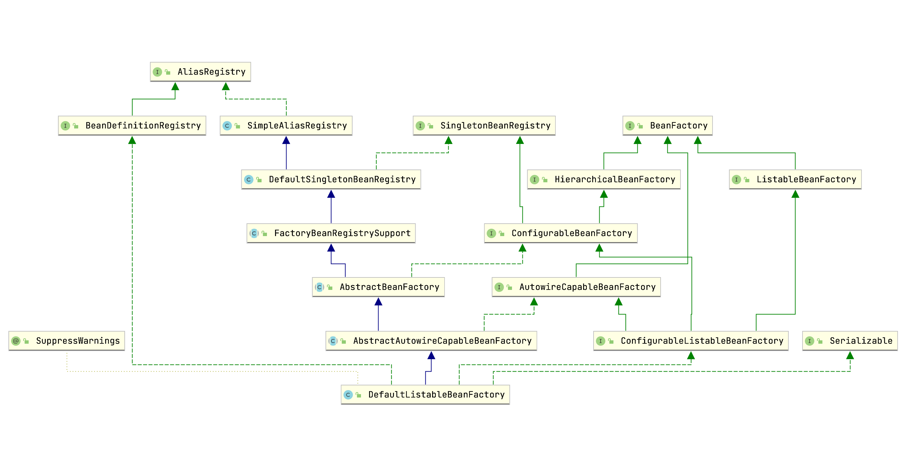
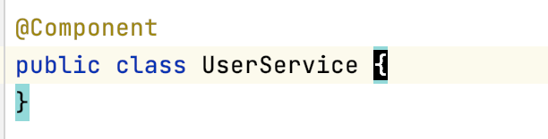
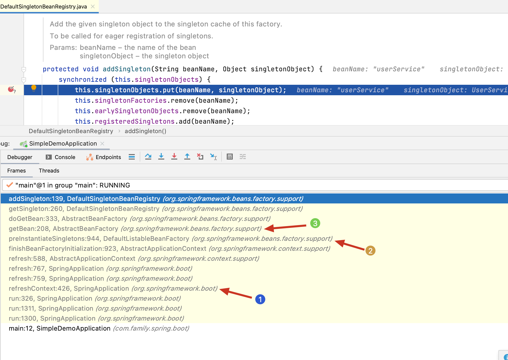
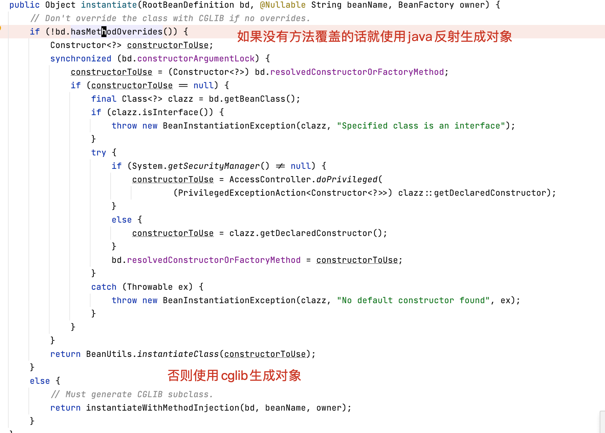
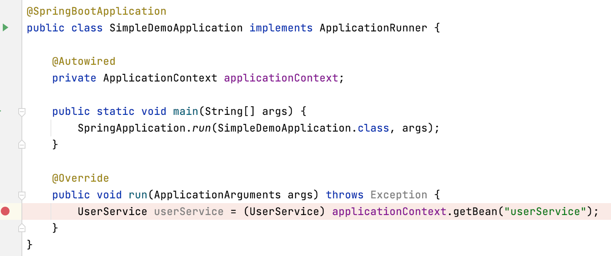
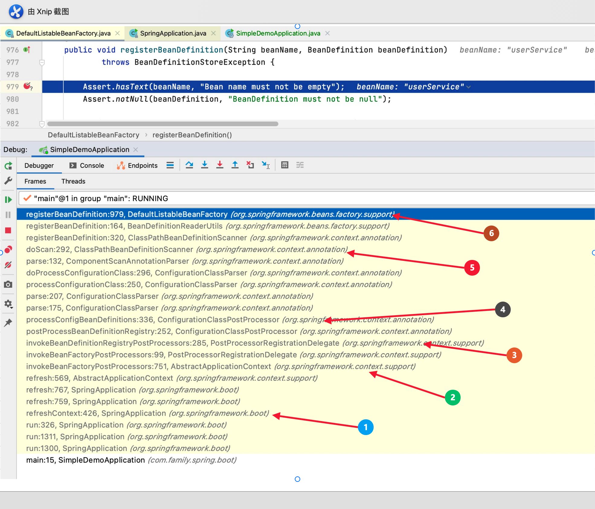
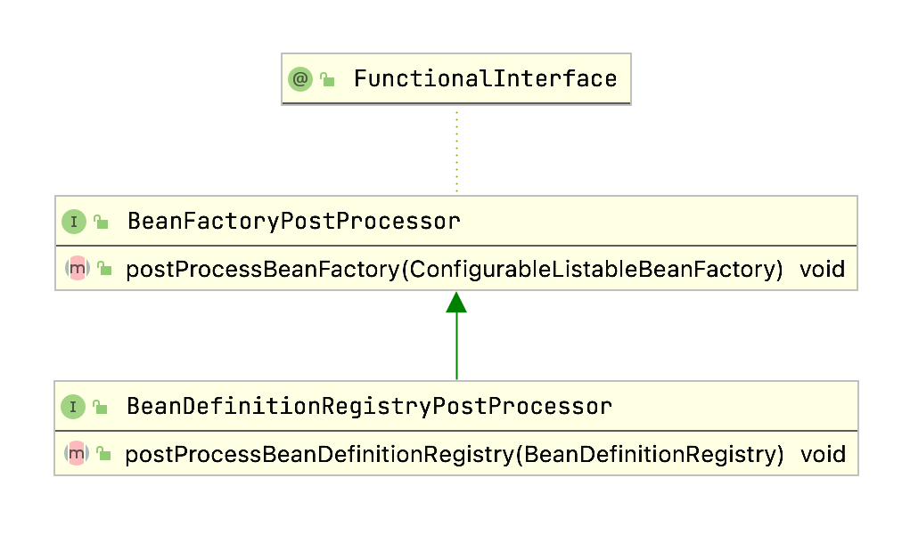
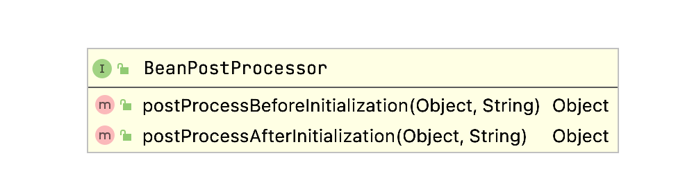
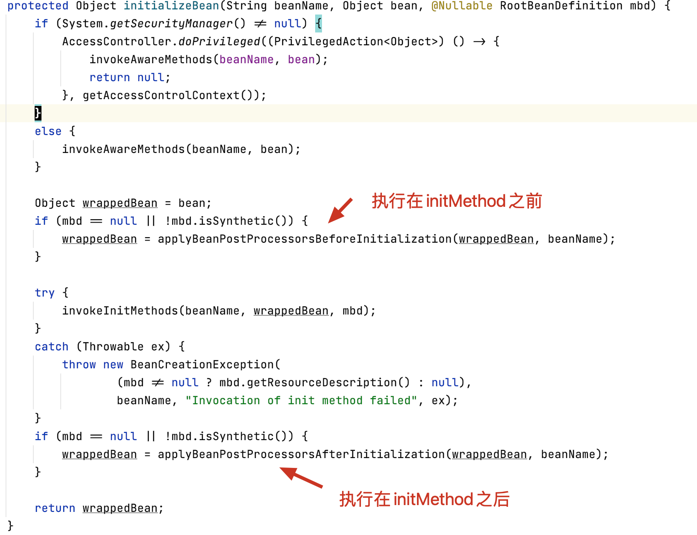

### 前言
`熟练掌握`这个词相信很多同行在写简历的时候都用到过。`熟练掌握`这四个字是根据每个人水平不一样，理解也不一样。比如一个刚毕业的大学生，他可能也会在简历里面写`熟练掌握spring框架`，但实际上他并没有看过spring源码，也没有太多实践。可能只是看了几本书，使用`spring框架`写了一个毕业设计，然后就说自己`熟练掌握spring框架`了。再比如一个有二三年工作经验的求职者，也在简历里面说自己`熟练掌握spring框架`，他的理由是他看过spring 的一些关键性代码了，也在实际工作中使用spring开发了工程项目。甚至自己根据一些业务需要，写了几个不错的针对spring框架的扩展。再比如一个工作了四五年的程序员，他在自己简历上写`熟练掌握spring框架`。因为他把spring和spring boot源码大部分都看过，工作中解决了不少涉及原理性的问题。对spring框架的整个架构图，基本了然于胸。另外总结出了非常多的spring相关的最佳实践。再比如一个工作了七八年的程序员，他们对`spring`的理解可能又不太一样。其实我想说的是，水平和经验决定了一个人的见解。每个人都应该虚心学习丰富和巩固自己的知识体系，拓宽知识的广度，加强知识的深度。这样才会在有限的时间里面，成长成参天大树。好了，废话不多说，今天的主题是`熟练掌握spring框架`。那么我就从n个问题着手。说一下工作了n年的我对`熟练掌握`的见解吧。

### BeanFactory和FactoryBean的区别

首先说下`BeanFactory`他是springIOC容器的顶层接口。负责管理和生产Bean。他的默认实现是：`DefaultListableBeanFactory`。在spring boot项目启动时，执行`createApplicationContext()`后返回的实例类型是`AnnotationConfigApplicationContext`，可以看下该类的层次结构图。发现他也是`BeanFactory`接口的实现类。代码是在`ApplicationContext`的抽象类`AbstractApplicationContext`中，可以看出所有`BeanFactory`的实现还是调用了`GenericApplicationContext`的成员`DefaultListableBeanFactory beanFactory` 的具体实现。所以Bean管理的核心代码自然就是`DefaultListableBeanFactory`。



查看它的类层次结构图发现，这个类主要扮演两个角色，第一个就是bean工厂，第二个就是`BeanDefinition`的注册中心。bean工厂提供了对单例bean注册中心（`DefaultSingletonBeanRegistry`），`FactoryBean`注册中心（`FactoryBeanRegistrySupport`）的支持。首先我们看下他是如何实现bean工厂的。

#### 注册单例`bean`

使用`@Component注解`定义一个`UserService`


断点设置在`DefaultSingletonBeanRegistry`单例bean注册中心的`addSingleton`中。

看下调用栈：



1. 发生在`refreshContext`阶段
2. 对单例模式bean进行初始化
3. 通过getBean触发实例化`userService` ，getBean进而调用`doGetBean` 

`doGetBean`方法可以稍微展开下

它调用了`DefaultSingletonBeanRegistry`的`getSingleton` 其中第二个参数就是`ObjectFactory`，创建bean的工厂`ObjectFactory` 实际调用的是`AbstractAutowireCapableBeanFactory`的`createBean`方法，进而调用它的`doCreateBean`，接着调用`createBeanInstance`方法，进而调用`instantiateBean`方法，使用`SimpleInstantiationStrategy` 策略类（实际使用的java反射技术动态创建对象）创建实例。



#### 获取单例`bean`

还是刚才那个例子。在`ApplicationRunner`的run方法调用`getBean`方法。



在`doGetBean`方法里会首先检查单利缓存里面是否有，如果有的话，直接返回。

#### `BeanDefinition`注册
我们再来看下`BeanDefinition`注册中心是如何实现的。
我们仍然是在`DefaultListableBeanFactory`的`registerBeanDefinition`设置断点，看下调用栈。


1. 同样发生在`refreshContext`阶段
2. 执行所有的`BeanFactoryPostProcessor` 
3. 执行所有的`BeanDefinitionRegistryPostProcessor`，此处默认就一个名为：`ConfigurationClassPostProcessor`
4. 此方法主要工作就是首先调用`ConfigurationClassUtils.checkConfigurationClassCandidate`找到所有`ConfigurationClass`的候选人，然后使用`ConfigurationClassParser`解析每个`ConfigurationClass`。
5. 如果是`ComponentScans`的`ConfigurationClass`，就调用`ClassPathBeanDefinitionScanner`的`doScan`进行扫描。
6. 将扫描的`BeanDefinition` 添加到`DefaultListableBeanFactory` 的 `beanDefinitionMap`里。至此完成`BeanDefinition`的注册。

#### FactoryBean
说了这么多，相信读者对`spring`框架的`BeanFactory`有了一个比较全面的了解了。下面聊聊`FactoryBean`。`FactoryBean`是spring 容器里的一种特殊的`bean`。
> 该接口的实现以`BeanFactory`为工厂。假设某个`Bean`实现了该接口，它用作生产对象的工厂。而不是像普通的`Bean`那样直接暴露自己。通常使用`getObject`方法暴露`bean`，`FactoryBean`支持单例和原型，并且可以可以按需延迟或者在启动的时候创建对象。这个接口在spring框架内部大量使用，比如`AOP`的` org.springframework.aop.framework.ProxyFactoryBean` `jpa`的`org.springframework.data.jpa.repository.support.JpaRepositoryFactoryBean`，然而在实际业务代码里面并不常见。
>
> 来源java doc

下面就以`JpaRepositoryFactoryBean`详细介绍下`FactoryBean`是如何工作的。

读者可以翻看下之前的一篇文章【JpaRepositoryBean创建流程分析】此处对于`repository` bean的初始化就不详细介绍了。我们还是在`ApplicationRunner`的run方法里调用`ApplicationContext`的`getBean`获取一个`UserRepository`，如果是第一次获取，流程是这样的。

1. 调用`BeanFactory`的`getBean`方法。
2. 实际逻辑在`AbstractBeanFactory`的`doGetBean`方法里。
3. 根据beanName `userRepository`在`SingletonBeanRegistry`里找到相应的`JpaRepositoryFactoryBean`
4. 然后根据在`FactoryBeanRegistry` 的缓存里（`factoryBeanObjectCache`）根据beanName查找`userRepository`，由于是第一次，所以找不到。
5. 调用`FactoryBeanRegistrySupport`的`getObjectFromFactoryBean`方法。该方法有个同步代码块，目的是保证并发情况下，创建的对象仍然是单例的。
6. 同步代码块里回去调用`JpaRepositoryFactoryBean`的`getObject`方法获取之前就已经创建好的`repository`，然后加入到`factoryBeanObjectCache`中去并返回相应的`bean`

#### 小结

通过源码学习，我们发现`BeanFactory`和`FactoryBean`是两个完全不同的概念，但是他们的代码又是紧密关联的。`FactoryBean`是`BeanFactory`里的一种特殊`bean`,因为他本身也是一个工厂，可以生产自己的`Bean` ，有个特殊的地方需要我们注意一下。如果传入的`beanName`是以`&`为前缀的话。会调用`BeanFactoryUtils`的`transformedBeanName`方法，去掉前缀，然后在Singleton注册中心获取相应的`bean`。如果找不到的话会有很长的一段代码进行处理。这里就不做深入探讨了，感兴趣的读者可以研究下。

### BeanPostProcessor和BeanFactoryPostProcessor

两个类都以`PostProcessor`结尾，中文名为后置处理器，意思就在`Bean`创建或者`BeanFactory`创建之后进行的操作。spring核心代码里面`PostProcessor`随处可见。

首先我们来看下`BeanFactoryPostProcessor`，来张UML图。这个图很简单，`BeanFactoryPostProcessor`定义了一个方法。参数就是刚刚创建的bean工厂。而`BeanDefinitionRegistryPostProcessor`定义的方法，参数就是刚刚创建好的`BeanDefinition`注册中心。



我们以一个最具有代表性的类`ConfigurationClassPostProcessor` 看下它是何时调用的，它做了什么。我们将断点设置在它的`postProcessBeanFactory`和`postProcessBeanDefinitionRegistry`方法里。发现发生在spring启动的`refreshContext`阶段，此时Bean工厂已经创建了。先调用所有的`BeanDefinitionRegistryPostProcessor`再调用所有`BeanFactoryPostProcessor`。详见`PostProcessorRegistrationDelegate`的`invokeBeanFactoryPostProcessors`。`ConfigurationClassPostProcessor`两次都会被调到。
```java
public void postProcessBeanDefinitionRegistry(BeanDefinitionRegistry registry) {
		int registryId = System.identityHashCode(registry);
		if (this.registriesPostProcessed.contains(registryId)) {
			throw new IllegalStateException(
					"postProcessBeanDefinitionRegistry already called on this post-processor against " + registry);
		}
		if (this.factoriesPostProcessed.contains(registryId)) {
			throw new IllegalStateException(
					"postProcessBeanFactory already called on this post-processor against " + registry);
		}
		this.registriesPostProcessed.add(registryId);
    //核心逻辑在processConfigBeanDefinition()方法中，用来处理BeanDefinition的注册
		processConfigBeanDefinitions(registry);
}
```

```java
public void postProcessBeanFactory(ConfigurableListableBeanFactory beanFactory) {
		int factoryId = System.identityHashCode(beanFactory);
		if (this.factoriesPostProcessed.contains(factoryId)) {
			throw new IllegalStateException(
					"postProcessBeanFactory already called on this post-processor against " + beanFactory);
		}
		this.factoriesPostProcessed.add(factoryId);
		if (!this.registriesPostProcessed.contains(factoryId)) {
			// BeanDefinitionRegistryPostProcessor hook apparently not supported...
			// Simply call processConfigurationClasses lazily at this point then.
			processConfigBeanDefinitions((BeanDefinitionRegistry) beanFactory);
		}

    // 对加了@Configuration注解的配置类进行Cglib增强代理
		enhanceConfigurationClasses(beanFactory);
    // 添加一个BeanPostProcessor后置处理器
		beanFactory.addBeanPostProcessor(new ImportAwareBeanPostProcessor(beanFactory));
}
```

`ConfigurationClassPostProcessor`无疑是spring中最重要也是最复杂的后置处理器了，此处就不详细展开了。再来看下`BeanPostProcessor`的UML图。



这两个方法调用的地方都是在`AbstractAutowireCapableBeanFactory`的`initializeBean`中。



看个简单的例子吧，上面学习`ConfigurationClassPostProcessor`时，我们发现它添加了一个bean后置处理器`ImportAwareBeanPostProcessor`，下面是它的`postProcessBeforeInitialization`方法

```java
//如果bean实现了ImportAware接口，就调用一下它的setImportMetadata方法，通过这种方式，可以在程序中拿到注解的元数据。
public Object postProcessBeforeInitialization(Object bean, String beanName) {
			if (bean instanceof ImportAware) {
				ImportRegistry ir = this.beanFactory.getBean(IMPORT_REGISTRY_BEAN_NAME, ImportRegistry.class);
				AnnotationMetadata importingClass = ir.getImportingClassFor(ClassUtils.getUserClass(bean).getName());
				if (importingClass != null) {
					((ImportAware) bean).setImportMetadata(importingClass);
				}
			}
			return bean;
}
```

上面是spring内置的一个处理器。实际工作中，我们也会经常自定义后置处理器。一个常见的场景就是对某些类进行动态增强。

未完待续，更多内容请关注【熟练掌握spring框架】第二篇