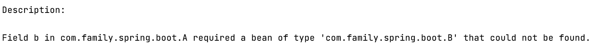
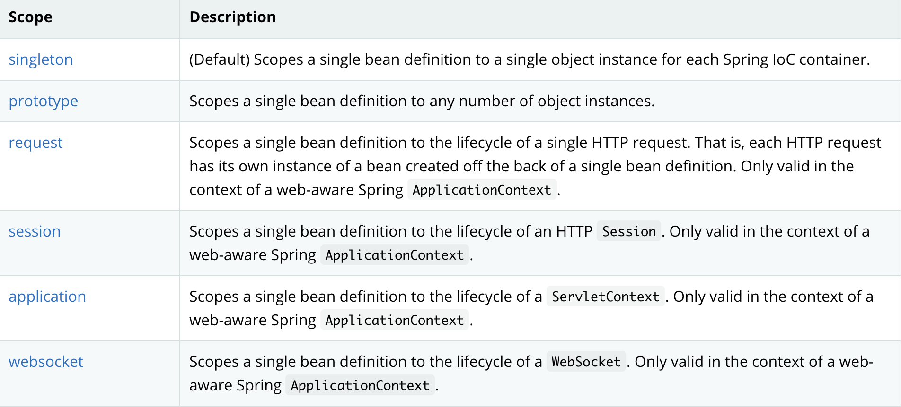
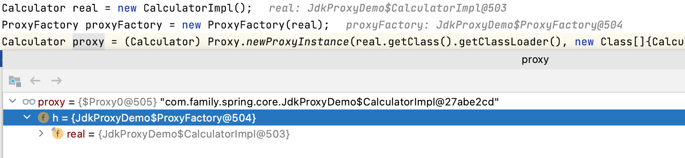
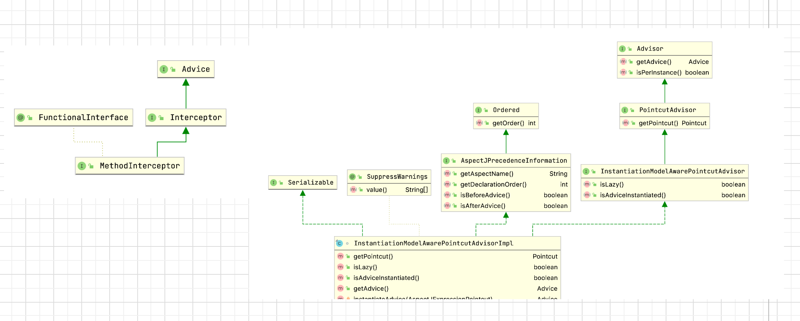

接上篇【熟练掌握spring框架第二篇】

### bean的生命周期

参考：http://javainsimpleway.com/spring-bean-life-cycle/

这是一个比较基础但是又比较高频的面试题。如果面试官问你spring bean的生命周期都有哪些？那应该怎样回答呢？在回答之前可以先分析一下这个题目。首先想想面试官问这个问题的目的是什么？换位思考，如果我是面试官，我希望通过这个题目了解求职者对`spring`框架的了解程度，它是如何管理`bean`的。在整个`bean`对生命周期中都有哪些是我们可以参与的。常用的场景是什么？不同类型的`bean`的生命周期有什么不同吗？如果求职者这几个问题都能清楚的表示出来，那我认为这道面试题他pass了。学习bean的生命周期目的还是为了在实际工作中可以进行自由扩展。以满足业务需要。那下面就从这几个方面分析下`bean`的生命周期。

先看下下面这张图，来源：http://javainsimpleway.com/spring-bean-life-cycle/


1. 首先实例化`bean`
2. `populateBean`
3. 调用初始化方法之前首先调用所有`bean`的`有感知`的方法，包括`BeanNameAware`，`BeanClassLoaderAware`，`BeanFactoryAware`。
4. 然后执行`BeanPostProcessor`的`postProcessBeforeInitialization`
5. 执行初始化方法，如果bean实现了`InitializingBean`会调用他的`afterPropertiesSet`方法。比如之前提到的`RepositoryFactoryBeanSupport`就通过`afterPropertiesSet`进行`repository`的创建。
6. 反射调用自定义`init-method`方法。
7. 然后执行`BeanPostProcessor`的`postProcessAfterInitialization`

其中当执行到`ApplicationContextAwareProcessor`的`postProcessBeforeInitialization`时，调用`bean`的应用级的`有感知`的方法。比如`ApplicationContextAware`，`EnvironmentAware`这些。

我们熟悉的`BeanPostProcessor`还有`AutowiredAnnotationBeanPostProcessor`，用来进行属性自动装配。

`RequiredAnnotationBeanPostProcessor`，它可以确保声明"必需"属性的bean实际上已配置了值，否则就会爆出类似下面这样的错误

> 

`CommonAnnotationBeanPostProcessor`处理`@PostConstruct`和`@PreDestroy`，执行`@PostConstruct`的逻辑是在它的父类`InitDestroyAnnotationBeanPostProcessor`的`postProcessBeforeInitialization`里进行的。执行`@PreDestroy`的逻辑是在`InitDestroyAnnotationBeanPostProcessor`的`postProcessBeforeDestruction`里进行的。

所以`@PostConstruct`执行的时候，`bean`的属性已经装填完成了。并且只会被执行一次，可以执行一些需要依赖项的初始化工作。

`@PreDestroy`的原理是利用了jdk的`shutdown hook`，可以实现应用程序的优雅关闭。注意`shutdown hook`不应该执行耗时的操作，这样会导致程序不能正常退出。一般运维写脚本的时候都会设置一个超时时间，一旦超过，就使用`kill -9`强制退出。

Spring管理的Bean默认是单例的。bean的所有scope有如下这些

> 
> 来源：spring官方文档

`request` `session` `application` 只存在于web应用上下文中。`websocket`存在websocket环境中。这些本文不做详细描述，`singleton`详细读者已经很熟悉了，那么我们着重关注下`prototype`这个类型。

```java
@Component
@Scope(BeanDefinition.SCOPE_PROTOTYPE)
public class A {  
}
```

定义一个简单的类，声明为scope为`prototype`。spring启动后调用`applicationContext.getBean("a")`，代码流程大致如下。

1. 调用`AbstractBeanFactory`的`doGetBean`方法
2. 判断如果原型bean正在创建则直接抛出异常。
3. 拿到相应的`BeanDefinition`，判断如果是`Prototype`类型
4. 调用`beforePrototypeCreation`标记正在创建
5. `createBean`创建`bean`，和创建单例`bean`是同一个方法。
6. 调用`afterPrototypeCreation`清除标记

所以`prototype`类型的bean是不支持循环依赖的。另外由于和创建`singleton`的`bean`是同一个方法，所以`bean`的所有`有感知的方法`也都是差不多的。一个很重要的不同就是原型`bean`的`@PreDestroy`是不会执行的。原因很简单destroy方法是通过shutdownhook调用`beanFactory`的`destroySingletons`方法实现的。spring没有定义`prototype`bean的销毁动作。

更多详细的解释可以参考：https://bluebreeze0812.github.io/learn/2019/10/17/Spring-Destroy-Prototype-Beans/

### spring 动态代理与AOP

#### 代理模式


代理模式是`GoF` 23种Java常用设计模式之一，隶属于结构型模式。一个随处可见的应用场景就是`rpc框架`比如dubbo里面的service调用。本地调用的service实际上是远程对象的代理对象。调用代理对象的方法实际是调用了远程对象的方法。又比如 `JAVA RMI` ，当然了对远程代理这里不做过多描述。今天我们要讲的是`spring`的动态代理。众所周知，Spring代理实际上是对`JDK代理`和`CGLIB`代理做了一层封装。那么我们先来看下jdk和cglib代理。这也是烹饪`spring aop`这道大菜比不可少的佐料。

####  JDK动态代理

```java
public class JdkProxyDemo {
    public interface Calculator {
        int add(int a, int b);
        int subtract(int a, int b);
    }
    public static class CalculatorImpl implements Calculator {
        @Override
        public int add(int a, int b) {
            return a + b;
        }
        @Override
        public int subtract(int a, int b) {
            return a - b;
        }
    }
    public static class ProxyFactory implements InvocationHandler {
        private final Calculator real;
        public ProxyFactory(Calculator real) {
            this.real = real;
        }
        @Override
        public Object invoke(Object proxy, Method method, Object[] args) throws Throwable {
            System.out.println("before");
            Object result = method.invoke(real, args);
            System.out.println("after");
            return result;
        }
    }
    public static void main(String[] args) {
        Calculator real = new CalculatorImpl();
        ProxyFactory proxyFactory = new ProxyFactory(real);
        Calculator proxy = (Calculator) Proxy.newProxyInstance(real.getClass().getClassLoader(), new Class[]{Calculator.class}, proxyFactory);
        System.out.println(proxy.add(1, 2));
        System.out.println(proxy.subtract(2, 1));
    }
}
```

由上面这个简单的例子可以总结出`jdk动态代理`有如下特点。

1. 创建代理对象需要三要素：类加载器，代理对象需要实现的接口列表。`InvocationHandler`实例。



2. 代理对象的class是`com.sun.proxy.$Proxy0`实现了`Calculator`接口
3. 代理对象持有`InvocationHandler`实例的引用，而`InvocationHandler`持有被代理对象的引用。
4. `InvocationHandler`的invoke方法代理了接口的所有方法。你可以在被代理对象执行前后添加逻辑，你甚至不调用代理对象的方法都可以。
5. 代理对象需要实现的接口列表是必须的。这也是jdk动态代理最大的特点。代理对象和被代理对象都实现了共同的接口。否则是无法代理的。

#### cglib动态代理

字节码生成类库，它封装了`ASM`，它是一个字节码操作框架，类似的框架还有`javaassit`，大概原理就是解析`.class`文件然后动态修改它。

```java
public class CglibProxyDemo {
    public static class Calculator {
        public int add(int a, int b) {
            return a + b;
        }
    }
    public static class CalculatorInterceptor implements MethodInterceptor {
        @Override
        public Object intercept(Object o, Method method, Object[] objects, MethodProxy methodProxy) throws Throwable {
            System.out.println("before add");
            Object o1 = methodProxy.invokeSuper(o, objects);
            System.out.println("after add");
            return o1;
        }
    }
    public static void main(String[] args) {
        Enhancer enhancer = new Enhancer();
        enhancer.setSuperclass(Calculator.class);
        enhancer.setCallback(new CalculatorInterceptor());
        Calculator calculator = (Calculator) enhancer.create();
        System.out.println(calculator.add(1, 2));
    }
}
```

由上面这个简单的例子我们可以总结出cglib动态代理有如下特点：

1. 生成的代理对象的class是`com.family.spring.core.CglibProxyDemo$Calculator$$EnhancerByCGLIB$$b4da3734`
2. 它是`Calculator`类的子类。遵循继承规则，子类不能覆盖父类的私有方法。也就是说私有方法是不能被代理的。
3. `MethodInterceptor`定义了一个方法拦截器。这个拦截器会拦截代理类的所有可以代理的方法。你也可以决定是否调用父类真实的方法。
4. cglib代理和jdk代理有两个**很重要**的区别，第一就是不需要共同的接口，第二不需要准备一个被代理的对象。

如果读者对于代理的class结构到底是什么样感兴趣的话。也可以使用java代理技术读取jvm里面相应的class文件，进行分析。

#### spring动态代理
##### 为什么需要AOP
软件开发是一个演变的过程，从最初的POP(面向过程程序设计)到OOP(面向对象程序设计)再到AOP(面向切面编程)，未来可能还有一堆的OP，每种编程思想都是软件开发进化的产物。都是为了解决特定的问题应运而生的。那么AOP产生的背景是什么呢。我认为随着软件系统的复杂化，一些与核心业务逻辑无关的内容越来越多。比如：记录日志，权限验证，事务控制，错误信息检测。而这些逻辑又散落在程序的每一个地方。这样不仅会增加写代码的复杂性和工作量，还会大大增加代码的维护成本。比如权限验证，如果每个接口都手写代码去判断当前用户是否有该接口的访问权限的话，那真的很蛋疼。所以聪明的程序员们就想把这些代码放到同一个地方，然后采取动态植入的方式添加到业务代码执行前后，这样代码统一起来了，而且业务逻辑里面几乎看不到添加的代码，程序员就可以专心致志的进行`CRUD`了，这种设计思想有个高大上的名字就是`AOP`，英文全称是`Aspect Oriented Programming`，维基百科管这个叫编程范式。为了让这个设计理念更加专业化，还特地引入一堆的专业术语。下面就简单阐述下每个术语的含义。

| 术语             | 含义                                                         |
| :--------------- | ------------------------------------------------------------ |
| 通知 Advice      | 类似于前面说的权限验证，spring`aop`支持的通知有：前置通知，后置通知，异常通知，最终通知，环绕通知五种 |
| 连接点 JoinPoint | 就是允许使用通知的地方，比如说方法连接点（方法执行前后），异常连接点（抛出异常时）等 |
| 切点 Pointcut    | 织入通知的连接点就叫做切点。                                 |
| 切面 Aspect      | 切面就是通知和切点的结合，两者组合一起定义了切面三要素：`要做什么`，`何时做`，`何地做`。 |
| 织入 weaving     | 把切面应用到目标对象来创建新的代理对象的过程                 |

有了上面的概念理解，我们对`spring aop`仍然是理论层面的。那么他的实现是怎样的呢。下面就以一个简单的例子一探究竟。
核心代码：

```java
@Aspect
@Component
public class MonitorAspect {
    @Pointcut("execution(* com.family.spring.core..*.*(..))  ")
    public void pointCut() {
    }
    @Around("pointCut()")
    public Object around(ProceedingJoinPoint pjp) throws Throwable {
        StopWatch stopWatch = new StopWatch();
        stopWatch.start();
        Object result = pjp.proceed();
        stopWatch.stop();
        System.out.println("执行" + pjp.getSignature().getName() + "共花费了" + stopWatch.getTotalTimeMillis() + "毫秒");
        return result;
    }
}
@SpringBootApplication
@EnableAspectJAutoProxy
public class SpringAopDemoApplication implements ApplicationRunner {
    @Autowired
    private ApplicationContext applicationContext;
    public static void main(String[] args) {
        SpringApplication.run(SpringAopDemoApplication.class, args);
    }
    @Override
    public void run(ApplicationArguments args) throws Exception {
        UserService userService = (UserService) applicationContext.getBean("userService");
        userService.login();
        userService.register();
    }
}
//userService很简单，就定义了两个方法: login register
```

程序输出是这样的：

>执行login共花费了1000毫秒
>执行register共花费了2000毫秒
>执行run共花费了3009毫秒

分析：getBean拿到的`userService`肯定是代理之后的对象。那它是什么时候被代理的呢。debug发现在执行`bean`的初始化时，会调用所有的`BeanPostProcessor`逐个处理。其中有一个特别的`Processor`是：`AnnotationAwareAspectJAutoProxyCreator`，而这个`processor`就是`@EnableAspectJAutoProxy`引入的。打开注解 `@EnableAspectJAutoProxy`的源码发现，它的核心是导入了一个`AspectJAutoProxyRegistrar`(AspectJ自动代理登记员)的类。而这个类的作用就是往注册中心注册`AnnotationAwareAspectJAutoProxyCreator`这个`BeanPostProcessor`。是不是和之前说的`@EnableJpaRepositories` 如出一辙。线索找到了，接下来就是解刨它的`postProcessAfterInitialization`方法了。

```java
public Object postProcessAfterInitialization(@Nullable Object bean, String beanName) {
		if (bean != null) {
			Object cacheKey = getCacheKey(bean.getClass(), beanName);
			if (this.earlyProxyReferences.remove(cacheKey) != bean) {
				return wrapIfNecessary(bean, beanName, cacheKey);
			}
		}
		return bean;
}
//wrapIfNecessary就是用来生成代理对象的。
```

继续跟进，终于找到了进行对象代理的罪魁祸首了。就是我们的`ProxyFactory` 了

```java
ProxyFactory proxyFactory = new ProxyFactory();
proxyFactory.copyFrom(this);

if (!proxyFactory.isProxyTargetClass()) {
  if (shouldProxyTargetClass(beanClass, beanName)) {
    proxyFactory.setProxyTargetClass(true);
  }
  else {
    evaluateProxyInterfaces(beanClass, proxyFactory);
  }
}

Advisor[] advisors = buildAdvisors(beanName, specificInterceptors);
proxyFactory.addAdvisors(advisors);
proxyFactory.setTargetSource(targetSource);
customizeProxyFactory(proxyFactory);

proxyFactory.setFrozen(this.freezeProxy);
if (advisorsPreFiltered()) {
  proxyFactory.setPreFiltered(true);
}

return proxyFactory.getProxy(getProxyClassLoader());
```

这是spring对jdk和cglib动态代理的一个封装类。它的`getProxy`里的`createAopProxy`方法是这样的。

```java
public AopProxy createAopProxy(AdvisedSupport config) throws AopConfigException {
		if (!IN_NATIVE_IMAGE &&
				(config.isOptimize() || config.isProxyTargetClass() || hasNoUserSuppliedProxyInterfaces(config))) {
			Class<?> targetClass = config.getTargetClass();
			if (targetClass == null) {
				throw new AopConfigException("TargetSource cannot determine target class: " +
						"Either an interface or a target is required for proxy creation.");
			}
			if (targetClass.isInterface() || Proxy.isProxyClass(targetClass)) {
				return new JdkDynamicAopProxy(config);
			}
			return new ObjenesisCglibAopProxy(config);
		}
		else {
			return new JdkDynamicAopProxy(config);
		}
}
```

翻译成自然语言就是`optimize`，`proxyTargetClass`，被代理的类没有接口这三个条件其中任何一个成立，就有机会走cglib动态代理，否则都是走jdk动态代理。另外就算判断有机会走cglib的话，如果目标类是接口还是会走jdk动态代理。下面看下sping aop中关于切面的抽象



使用`ProxyFactory`代理对象，是必须要添加通知的。如果没有通知就好比代理对象收了钱，但是啥事也没干。一种简单的添加方式是，传入一个`MethodInterceptor`，实现拦截。

```java
proxyFactory.addAdvice((MethodInterceptor) invocation -> {
      System.out.println("before");
      Object result = invocation.proceed();
      System.out.println("after");
      return result;
});
```

但是更高级的方式就是添加`Advisor`，可以翻译为顾问，让顾问告诉我通知是什么？spring内置了一个强大的顾问，名为`InstantiationModelAwarePointcutAdvisorImpl`，它的`getAdvice`方法，可以动态的返回不同类型的通知。详见：`ReflectiveAspectJAdvisorFactory`的`getAdvice`方法。前面说的那个`BeanPostProcessor`正是添加了这个顾问实现了环绕通知。

未完待续，更多内容请关注【熟练掌握spring框架】第四篇