接上篇【熟练掌握spring框架第一篇】

### spring依赖注入是怎么实现的

#### 依赖注入的方式有哪些
1. 基于构造器注入 `setter-based injection`
2. 基于set方法注入 `constructor-based injection`
3. 属性注入 `field-based injection`

#### 为什么spring推荐使用构造器注入

参考文章：

https://blog.marcnuri.com/field-injection-is-not-recommended/

https://www.javacodegeeks.com/2019/02/field-setter-constructor-injection.html

英文原文档：https://docs.spring.io/spring-framework/docs/current/reference/html/core.html#beans-setter-injection

>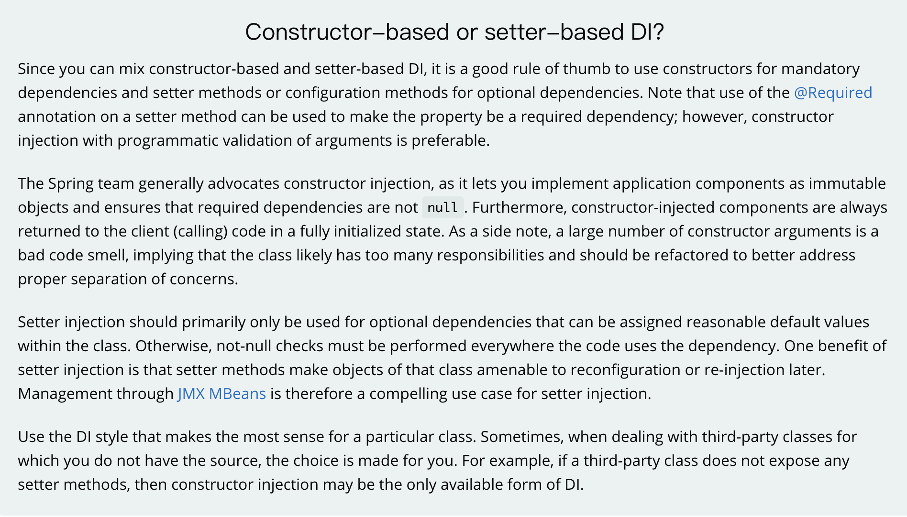

* 使用构造器注入可以保证强依赖
* 可以保证对象不可变
* 如果构造器参数过多，就要考虑是否对象承担了太多了职责，是否应该进行职责拆分。使用setter方法注入就不容易发现
* 可以降低容器耦合度，方便单元测试。
* 使用setter方法注入隐藏了组件之间的依赖关系。

#### 构造器注入

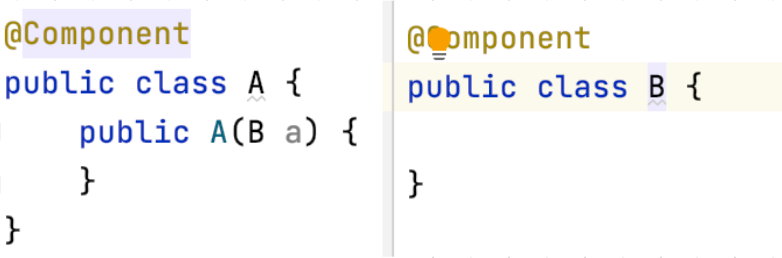

如上图：组件A通过构造器注入组件B
注意：在 Spring4.x 中增加了新的特性：如果类只提供了`一个带参数的构造方法`，则不需要对其内部的属性写 `@Autowired` 注解，Spring 会自动为你注入属性。


1. 发生在`refreshContext`阶段
2. 初始化单例`bean`
3. 调用`bean`工厂的`getBean`触发创建`bean`
4. 创建`bean`
5. 自动装配构造方法
6. 创建依赖的`bean`

#### field-based injection

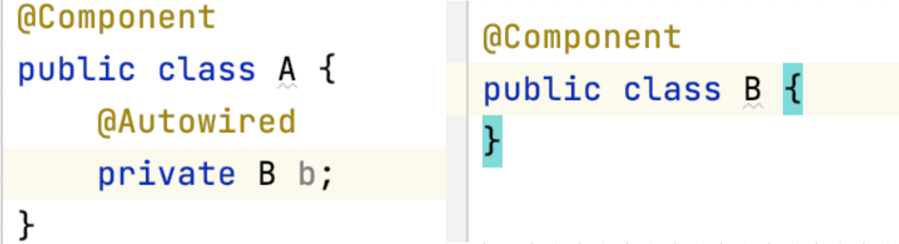

如上图：组件A通过属性注入B

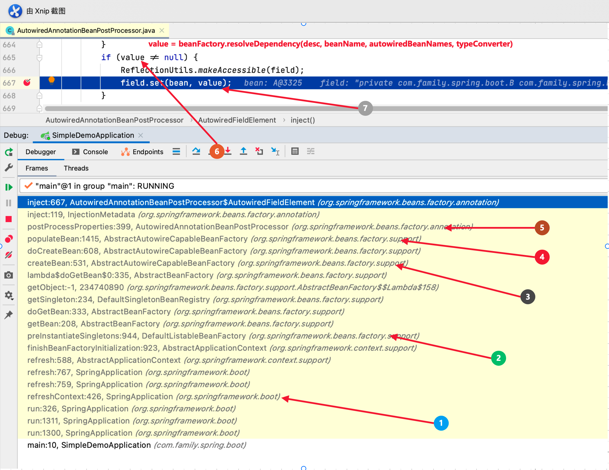

1. 仍然发生在`refreshContext`阶段
2. 初始化单例`bean`
3. 创建`bean`
4. 填充`bean`
5. 执行每个`InstantiationAwareBeanPostProcessor`的`postProcessProperties`包括`AutowiredAnnotationBeanPostProcessor`
6. 执行`bean`工厂的`resolveDependency`生成依赖bean
7. 利用反射设置属性

#### setter方法注入

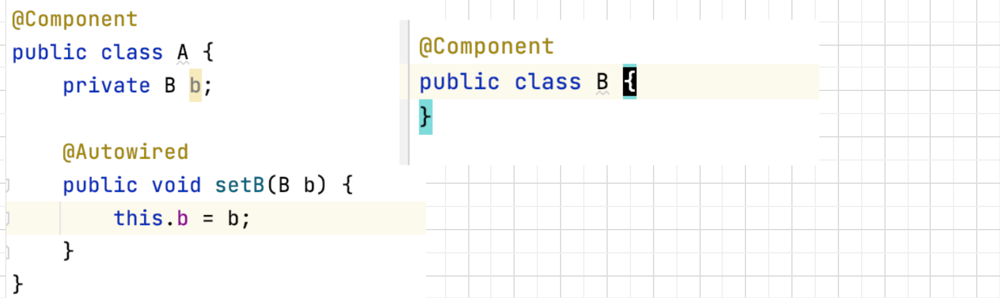

如上图：组件A使用setter方法注入组件B

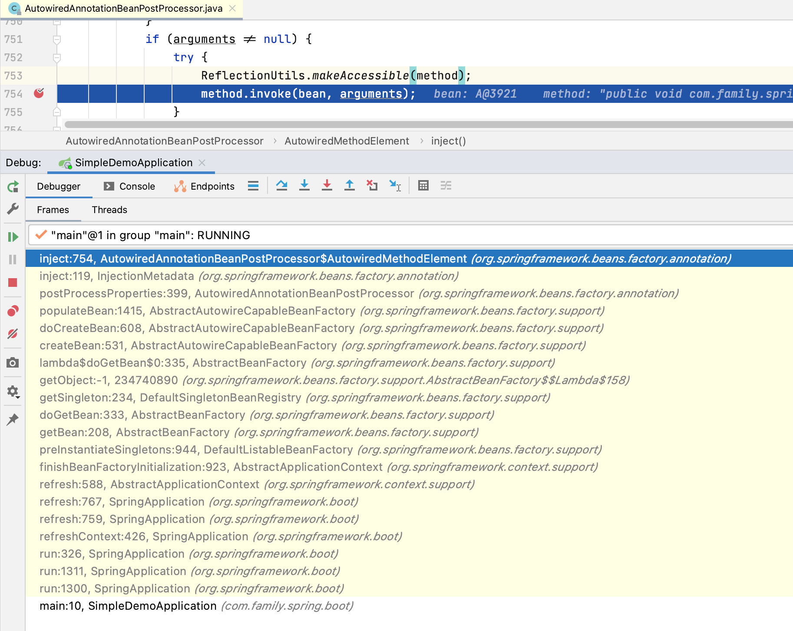

可以看出setter方法注入和属性注入流程是一样的。唯一不同的是属性注入是通过调用`Field`的`set`方法，而setter方法注入是调用`Method`的`invoke`方法。

#### 小结
通过上面的学习，我们已经对spring的核心功能依赖注入有了一个全面的了解。另外相信读者对整个`bean`创建流程也有了一个大概的了解，spring框架按照自然顺序加载每个类，如果有依赖的组件，会直接创建依赖的组件。上面选择的几个例子都是比较简单易懂的。spring轻松搞定。那如果组件A依赖B，组件B依赖A这种循环依赖的情况，spring是怎么处理的呢。下面我们就来一起揭秘spring为了解决循环依赖都做了什么？

### spring循环依赖和三级缓存

参考资料：

https://www.cnblogs.com/lwh1019/p/13260273.html

https://blog.csdn.net/zhouyu5408/article/details/107055811

https://juejin.cn/post/6844903715602694152

首先我们还是演示一下出现循环依赖导致程序启动失败的一个demo

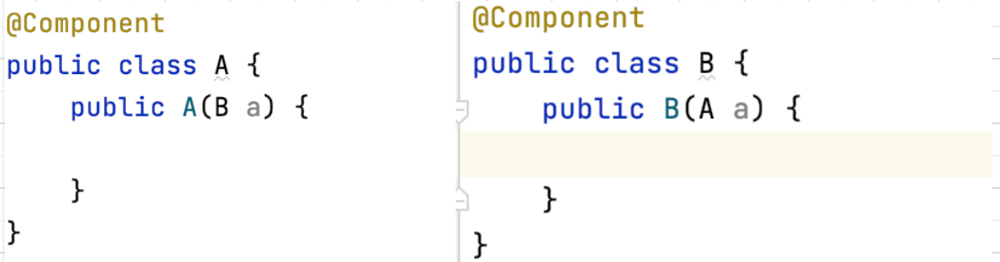

如上图：A组件通过构造器注入B，B组件通过构造器注入A

运行报错：

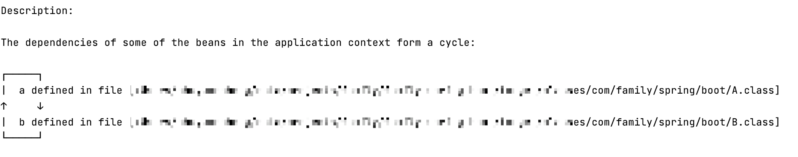

提示很明确了。A和B的依赖形成了一个环。我们再来看下报错的位置。

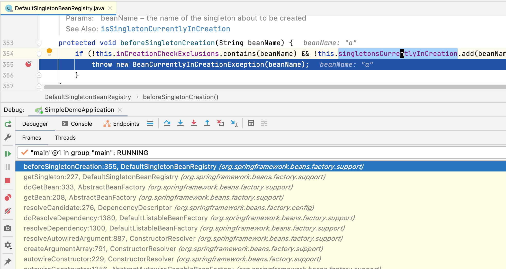

用个流程图解释下大概就是这么回事。

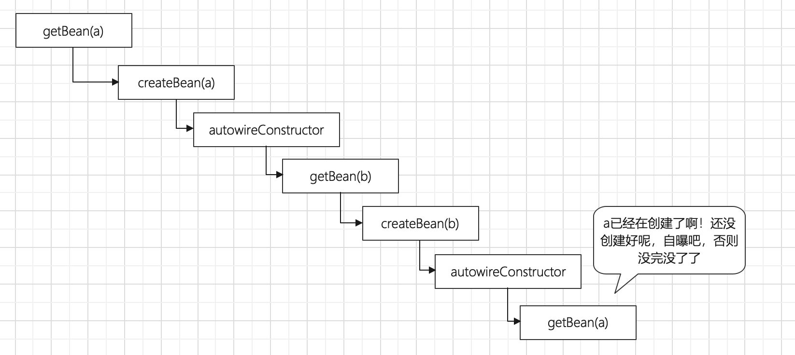

整个过程没毛病！
接下来我们看看三级缓存是怎么回事。
`DefaultSingletonBeanRegistry`有三个map。

* 一级缓存`singletonFactories`
* 二级缓存`earlySingletonObjects`
* 三级缓存`singletonFactories`

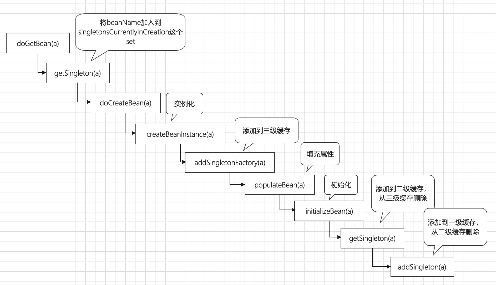

整个缓存使用的过程大致如上图所示。

比如说A依赖B，B又依赖A，那么在`populateBean(a)`的时候会去创建`B`，然后创建`B`的时候又会去调`getBean(a)`，此时调用`getSingleton(a)`就会从之前的三级缓存里去找`A` 找到之后并且将`A`移入到二级缓存中。注意此时`A`还是未初始化的`bean`是不能进入一级缓存的。`B`创建好了并填充到`A`，然后初始化`A`，接着调用`getSingleton(a)`从二级缓存中找到`A`，最后执行`addSingleton(a)`添加到一级缓存，并从二级缓存中移除。

#### 问题1：给`B`填充的是未初始化的`A`，那B是不是有问题。
答案是否定的。虽然在创建B时会提前给B注入了一个还未初始化的A对象，但是在创建A的流程中一直使用的是注入到B中的A对象的引用，之后会根据这个引用对A进行初始化，所以这是没有问题的。
#### 问题2：三级缓存为什么是个`ObjectFactory`

我们看下工厂的`getObject`方法的实现。如果条件`hasInstantiationAwareBeanPostProcessors`不满足的话，和二级缓存是没有什么区别的。`hasInstantiationAwareBeanPostProcessors`这个条件是干啥的呢？这和spring aop有关。如果开启的话，会返回一个代理后的对象。而不是实例化阶段创建的对象。

```java
protected Object getEarlyBeanReference(String beanName, RootBeanDefinition mbd, Object bean) {
		Object exposedObject = bean;
		if (!mbd.isSynthetic() && hasInstantiationAwareBeanPostProcessors()) {
			for (SmartInstantiationAwareBeanPostProcessor bp : getBeanPostProcessorCache().smartInstantiationAware) {
				exposedObject = bp.getEarlyBeanReference(exposedObject, beanName);
			}
		}
		return exposedObject;
}
```

未完待续，更多内容请关注【熟练掌握spring框架】第三篇

