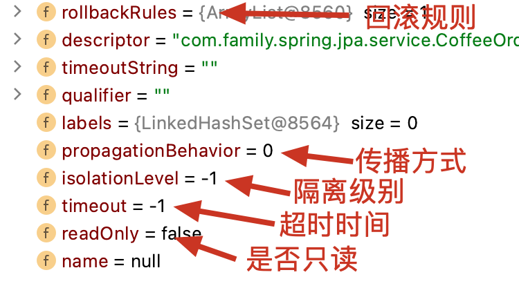

接上篇【熟练掌握spring框架第四篇】

### spring 数据源自动配置

程序员的日常工作中操作数据库无疑是最频繁的事情了。很多刚毕业的求职者很自信，不就是`CURD`嘛，谁不会呢。确实我们处在一个轮子满天飞时代，很多事情框架都已经代劳了。与其说写代码是盖房子，不如说是在搭积木。我们也不需要一砖一瓦的垒房子。那样成本太大了。但既然是搭积木，那么我们就要清楚每块积木的结构。这样才能搭建简单牢靠的房子呢。下面我们就通过源码学习下spring给我们提供的针对数据库操作的模块`spring-data-jdbc`是如何工作的吧。为了更好的说明问题，先来个简单的例子。


程序启动后会往`coffee`这个表里插入一条数据。那么问题来了。数据源，连接池呢。没错他们都被`spring`自动配置了。首先我们看下数据源自动配置。


`DataSourceProperties`实现了`InitializingBean`，它的`afterPropertiesSet`方法会根据当前加载的类自动判断内嵌数据库类型。


`DataSourceProperties`可以生成一个`DataSource`的建造器`DataSourceBuilder`，主要是设置`驱动class`，`连接url`，用户名和密码还有数据源类型。重点来了。创建出来的`DataSource`用来干嘛的呢？我们发现`DataSource`的所在的包是`tomcat-jdbc`，说明这件事情已经交给了`tomcat-jdbc`这个东东。

#### tomcat-jdbc

首先它是`Apache Commons DBCP`的替代品，官网好处说了一堆：https://tomcat.apache.org/tomcat-7.0-doc/jdbc-pool.html，我大致概括下：

1. 支持高并发。
2. 可以自定义拦截器
3. 高性能
4. 支持 JMX
5. 超简单：`tomcat-jdbc`只有8个核心文件，最重要的是`ConnectionPool`类
6. 更智能的空闲连接处理
7. 可以异步获取`Connection`：`Future<Connection>`
8. 自定义连接丢弃实时机：是连接池满了，还是连接使用超时了。

额……他说了不算，我们只相信源码。
#### 连接池的初始化

我们将断点设置在`DataSourceProxy`的`pCreatePool`里，看下它的调用栈。


随着第一次从数据源中获取`Connection`，`ConnectionPool`被创建了。创建连接池的时候主要执行了`ConnectionPool`的`init`方法。

```java
protected void init(PoolConfiguration properties) throws SQLException {
        poolProperties = properties;
        //检查连接池配置有无问题
        checkPoolConfiguration(properties);
        //初始化用于存放连接的繁忙队列
        busy = new LinkedBlockingQueue<>();
        //初始化用于存放连接的空闲队列
        idle = new FairBlockingQueue<>();
        //初始化定时任务：每5000毫秒一次进行连接池的健康检查。
        initializePoolCleaner(properties);

        //如果开启JMX，注册Mbean
        if (this.getPoolProperties().isJmxEnabled()) createMBean();
  
        //创建10个连接。
        PooledConnection[] initialPool = new PooledConnection[poolProperties.getInitialSize()];
        try {
            for (int i = 0; i < initialPool.length; i++) {
                //通过org.h2.Driver.connect方法逐个创建java.sql.Connection，并添加到繁忙队列中。
                initialPool[i] = this.borrowConnection(0, null, null); //don't wait, should be no contention
            } //for

        } catch (SQLException x) {
            log.error("Unable to create initial connections of pool.", x);
            if (!poolProperties.isIgnoreExceptionOnPreLoad()) {
                if (jmxPool!=null) jmxPool.notify(org.apache.tomcat.jdbc.pool.jmx.ConnectionPool.NOTIFY_INIT, getStackTrace(x));
                close(true);
                throw x;
            }
        } finally {
            //return the members as idle to the pool
            for (int i = 0; i < initialPool.length; i++) {
                if (initialPool[i] != null) {
                    //将10个连接逐个归还到idle队列中
                    try {this.returnConnection(initialPool[i]);}catch(Exception x){/*NOOP*/}
                } //end if
            } //for
        } //catch

        closed = false;
}
```

通过源码发现，`borrowConnection`，找谁借？找`idle`借。借了往哪放，往`busy`队列放，还的时候自然也是将`busy`的连接还给`idle`，如果连接不够，内部会再去创建新的连接，当然此时借的流程还是免不了的。那么问题来了。

##### 借了到底啥时候还

这个问题暂且放着。后面将事务的时候会解释到。

##### 能一直借吗

当然不能，读者可以参照下`ConnectionPool`的`private PooledConnection borrowConnection(int wait, String username, String password)`方法。它会先使用非阻塞的方式从`idle`拿，如果拿到了直接返回，如果拿不到。看下当前连接数有没有超过`maxActive`，默认是`100`哦。如果没有，创建一个。如果超过了。按照指定超时时间阻塞拿吧。这个超时时间如果`wait`传的是`-1`的话，默认是`maxWait`30秒。如果30秒之后还是拿不到连接呢。那只能自曝了。


##### 连接长时间不用会关闭吗

`tomcat连接池`有个配置项叫做`maxAge`。它的含义是：

> 连接保持时间（以毫秒计）。当连接要返回池中时，连接池会检查是否达到 `now - time-when-connected > maxAge` 的条件，如果条件达成，则关闭该连接，不再将其返回池中。默认值为 `0`，意味着连接将保持开放状态，在将连接返回池中时，不会执行任何年龄检查。

`PooledConnection`有个`isMaxAgeExpired`的方法就是用来检查是否超过了最大保持时间。`ConectionPool`有个`reconnectIfExpired`方法检查如果某个连接超过了最大保持时间，就进行重连，即先断开，再连接。而在归还连接的时候会执行`reconnectIfExpired`，所以如果设置了`maxAge`那么就有可能触发重连操作。

另外我们看还有个配置叫`maxIdle`。它的含义是：

> （整型值）池始终都应保留的连接的最大数目。默认为 `maxActive:100`。会周期性检查空闲连接（如果启用该功能），留滞时间超过 `minEvictableIdleTimeMillis` 的空闲连接将会被释放。

归还连接的时候，如果发现空闲队列的大小超过这个`阈值`，就会释放当前要归还的连接。即关闭该连接。

有了`maxIdle`，势必会有`minIdle`，它的含义是：`池始终都应保留的连接的最小数目`

定时清理任务`PoolCleaner`发现`idle`队列的大小如果超过这个值的话，就会检查每个连接，把当前时间减去最后一次`touched`的时间，如果超过`minEvictableIdleTimeMillis`，则释放连接。注意：这个配置项可没有maxXXX哦。

`tomcat`给了我们很多配置项，以便根据实际场景灵活变动。然而实际线上我们常常将`initialSize`，`minIdle`，`maxIdle`，这三个指标设置为一样大。是为什么呢。其实原因很简单。比如说1天的访问量，高峰期除外。50个`connection`就能应付了。那么这三个值就设置为50，这样连接数就基本保持不变。不会频繁的`connect`和`disconect`，因为连接也是很耗时的事情啊。如果时间都花在上面了，不就影响正确业务了吗？偶尔有个流量小高峰，没关系，连接数瞬间飙一下，又恢复到50了。所以这个值怎么定，我认为，如果一天中大部分时间都不会超过这个值，那么就是是它了。触类旁通，其实很多连接池的配置都可以参考这个套路。

#### 使用jmx监控ConnectionPool

从`DataSource`的继承关系，我们发现它是一个可以通过`jmx`管理的`bean`。但是使用之前必须开启它。

```properties
spring.datasource.tomcat.jmx-enabled=true
```

然后我们就可以使用jmx客户端`jconsole`查看了。不仅可以查看关心的指标，还可以执行一些操作。更厉害的是比如上面出现连接池获取不到连接时还会给jmx客户端推送一个通知。如果自己写代码实现客户端的话，就可以邮件告警啦。


### spring声明式事务

参考：https://blog.csdn.net/qq_36882793/article/details/107299307

#### 声明式事务由来
这个问题很好回答，前面介绍`AOP`这种编程范式时就提到过事务处理属于其中一个很典型的应用场景。可以说`AOP`编程范式的由来就是声明式事务的由来。不得不说声明式事务的诞生极大的方便了程序员进行事务管理，不，应该说是`AOP`的诞生极大地方便了程序员进行代码复用。
我们还是以一个超简单的例子作为引子。看看spring是如何实现声明式事务的。下面定义了一个`CoffeeOrderService`模拟保存两杯咖啡：`coffee1` `coffee2`。就是这么简单。

```java
@Service
public class CoffeeService {

    @Autowired
    private CoffeeRepository coffeeRepository;

    @Transactional(rollbackFor = RuntimeException.class)
    public void save(Coffee coffee1, Coffee coffee2) {
        coffeeRepository.save(coffee1);
        System.out.println(coffeeRepository.findAll());
        coffeeRepository.save(coffee2);
        System.out.println(coffeeRepository.findAll());
        throw new RuntimeException("挂了");
    }
}
```
我们使用`@Transactional`注解，就能保证`save`方法在执行开始时开启事务，执行结束时提交事务或者回滚事务。读者很容易想到这一定使用了`spring`的AOP技术。说到AOP，很自然想到此处一定是使用了cglib动态代理，因为没有接口呀。而且真正的拦截功能一定是交给了一个`MethodInterceptor`的实现类。下面我画了一张图，简单的阐述下`spring`自动配置是如何为事务管理提供的事务拦截器和如何应用这个拦截器到标记了`@Transactional`的类的。


spring的套路：

1. 通知`advice`并不是直接塞到`ProxyFactory`的，而是通过顾问`advisor`动态获取的。
2. 决定这个顾问要不要干涉`coffeeOrderService`的代理，核心代码是下面这段，根据目标类是否可以获取`TransactionAttribute` 来筛选候选的`顾问`。而获取`txAttr`的首要条件就是目标方法必须得有`@Transactional`注解。
```java
@Override
public boolean matches(Method method, Class<?> targetClass) {
		TransactionAttributeSource tas = getTransactionAttributeSource();
		return (tas == null || tas.getTransactionAttribute(method, targetClass) != null);
}

//来自 SpringTransactionAnnotationParser
public TransactionAttribute parseTransactionAnnotation(AnnotatedElement element) {
		AnnotationAttributes attributes = AnnotatedElementUtils.findMergedAnnotationAttributes(
				element, Transactional.class, false, false);
		if (attributes != null) {
			return parseTransactionAnnotation(attributes);
		}
		else {
			return null;
		}
}
```

我们理清了动态代理的机制。下面看看`TransactionInterceptor`是如何进行事务管理的。注意：下面贴的`invokeWithinTransaction`的源码是删减版的。我把默认情况下不会执行到的代码给省略掉了。

```java
protected Object invokeWithinTransaction(Method method, @Nullable Class<?> targetClass,
                                             final InvocationCallback invocation) throws Throwable {

        // If the transaction attribute is null, the method is non-transactional.
        TransactionAttributeSource tas = getTransactionAttributeSource();
        final TransactionAttribute txAttr = (tas != null ? tas.getTransactionAttribute(method, targetClass) : null);
        final TransactionManager tm = determineTransactionManager(txAttr);
        PlatformTransactionManager ptm = asPlatformTransactionManager(tm);
        final String joinpointIdentification = methodIdentification(method, targetClass, txAttr);
        TransactionInfo txInfo = createTransactionIfNecessary(ptm, txAttr, joinpointIdentification);
        Object retVal;
        try {
            // This is an around advice: Invoke the next interceptor in the chain.
            // This will normally result in a target object being invoked.
            retVal = invocation.proceedWithInvocation();
        } catch (Throwable ex) {
            // target invocation exception
            completeTransactionAfterThrowing(txInfo, ex);
            throw ex;
        } finally {
            cleanupTransactionInfo(txInfo);
        }
        commitTransactionAfterReturning(txInfo);
        return retVal;
}
```

1. 获取事务的基本属性`TransactionAttribute`包括：

2. 获取`事务管理器`，此处是默认的事务管理器，`JdbcTransactionManager`，因为我使用的是`spring-data-jdbc`，如果使用的是`spring-data-jpa`那就是`JpaTransactionManager`。事务管理器的`bean`是`DataSourceTransactionManagerAutoConfiguration`这个配置类引入的。


3. `createTransactionIfNecessary`，字面意思就是如果需要就创建事务。先来看下它的返回值。`TransactionInfo`


它其实是对`TransactionStatus`、`TransactionAttribute`、`TransactionManager` 等属性的进一步封装。我们先看下`TransactionStatus`，实际上是：`DefaultTransactionStatus`，它封装了事务状态。


可以看出，它封装了数据库连接。还有`保存点`信息。那么问题来了。

##### 这个连接是什么时候从连接池获取的

上面的例子中我把使用jdbc `profileSQL`功能将sql打印出来是这样的。
```sql
SET autocommit=0;
insert into coffee(name,price) values('拿铁',10);
select * from coffee;
insert into coffee(name,price) values('美式',20);
select * from coffee;
rollback;
SET autocommit=1;
```

我们看下开启事务的调用栈。


这个`obtainDataSource`获取的正是`tomcat-jdbc`的数据源。由于此处我是第一次尝试连接数据库，所以会进行连接池的初始化。此处有几处需要特殊说明一下。

* `AbstractPlatformTransactionManager#getTransaction` 调用`doGetTransaction`构建事务对象时会调用`TransactionSynchronizationManager.getResource(obtainDataSource())`获取数据库`连接持有者`。获取方式是从名为`resources`的`ThreadLocal`里面获取key为当前数据源的`连接持有者`。因为是第一次开启事务，显然是没有的。所以此处返回为null。紧接着判断是否已经开启事务时，就是根据是否包含连接持有者（`ConnectionHolder`）来判断的。例子中时没有开启的。所以`isExistingTransaction`返回为`false`
* 紧接着判断隔离级别，如果是`PROPAGATION_MANDATORY`，那么自爆掉。因为这个隔离级别是必须有一个已经存在的事务的。此处当然不会爆掉，因为默认隔离级别是`PROPAGATION_REQUIRED`。这个隔离级别就会调用`startTransaction`。
* `startTransaction`调用`doBegin`开启事务。它的任务实际就是从数据源获取一个连接，然后设置`autoCommit`为`false`开启事务。

##### savepointAllowed为什么是`true`

构建事务对象时，如果`TransactionManager`的`nestedTransactionAllowed`为`true`，则`savepointAllowed`也为`true`，而在初始化`JdbcTransactionManager`的时候会调用父类`DataSourceTransactionManager`的构造方法，将`nestedTransactionAllowed`设置为`true`
这个标记是用来决定是否支持嵌套事务。

##### savepoint如何支持嵌套事务的

首先回顾下spring定义的事务的7种传播行为

| 传播行为                  | 含义                                                         | 实现方式                                                     |
| ------------------------- | ------------------------------------------------------------ | ------------------------------------------------------------ |
| PROPAGATION_REQUIRED      | 如果当前没有事务，就新建一个事务，如果已经存在一个事务中，加入到这个事务中。这是默认的事务传播行为 | 略                                                           |
| PROPAGATION_SUPPORTS      | 支持当前事务，如果当前没有事务，就以非事务方式执行。         | 略                                                           |
| PROPAGATION_MANDATORY     | 使用当前的事务，如果当前没有事务，就抛出异常。               | 事务必须存在（是否还有`连接持有者`），否则直接抛出异常       |
| PROPAGATION_REQUIRES_NEW  | 新建事务，如果当前存在事务，把当前事务挂起。（一个新的事务将启动，而且如果有一个现有的事务在运行的话，则这个方法将在运行期被挂起，直到新的事务提交或者回滚才恢复执行。） | 如果已经存在事务，将原有的`连接持有者`挪到`suspendedResources`，然后重新获取连接，重新开启事务。 |
| PROPAGATION_NOT_SUPPORTED | 以非事务方式执行操作，如果当前存在事务，就把当前事务挂起。   | 挂起当前事务实际就是将当前事务的`连接持有者`移除到`suspendedResources`，恢复的时候，再从`suspendedResources`挪回给`连接持有者` |
| PROPAGATION_NEVER         | 以非事务方式执行，如果当前存在事务，则抛出异常。             | 如果存在事务（含有`连接持有者`）直接抛出异常                 |
| PROPAGATION_NESTED        | 如果当前存在事务，则在嵌套事务内执行。如果当前没有事务，则执行与PROPAGATION_REQUIRED类似的操作。（外层事务抛出异常回滚，那么内层事务必须回滚，反之内层事务并不影响外层事务） | 详细见下文                                                   |

`PROPAGATION_NESTED`这种传播行为就是靠`savepoint`实现的。`AbstractPlatformTransactionManager`的`handleExistingTransaction`方法里，如果是嵌套事务的话，首先判断是否允许嵌套事务，默认是允许的，如果不允许，抛异常。然后创建并持有`安全点`，可以回顾一下mysql安全点的知识，是能能够满足嵌套事务的要求的，就是内层事务回滚不会影响外层事务。

我们再来回答上面的数据库连接借了啥时候还的问题。很显然当事务提交之后。就可以将数据库连接还回去了。下图是调用栈。事务提交之后会进行一些清理动作，释放连接就是其中一项。

