接上篇【熟练掌握spring框架第三篇】

### Spring MVC 的工作流程

#### MVC架构模式

> MVC模式是软件工程中的一种软件架构模式，把软件系统分为三个基本部分：模型（Model）、视图（View）和控制器（Controller）
> 最早是由施乐研究中心提出的，大名鼎鼎的AspectJ也是他们提出的。
> 来自维基百科

**那么问题来了，为什么要引入这个模式？**
MVC要实现的目标是将软件用户界面和业务逻辑分离以使代码可扩展性、可复用性、可维护性、灵活性加强。也就是MVC的核心是把M和V分开，C存在的目的则是确保M和V的同步，一旦M改变，V应该同步更新。传统的mvc架构模式使用模版引擎进行视图的显示。常见的比如`jsp`，`Thymeleaf`等。但更为合理的是使用rest服务，进行前后端分离，前端专注页面渲染，后端专注业务逻辑和数据支持。我认为前后端分离是MVC架构模式最新的进化成果。前后端分离在我看来有如下几点显而易见的特点：

1. 分离之后，前端静态资源文件可以使用`cdn`加速。
2. 更易于技术的更新换代。比如说前端想从`react`技术栈切到`vue`技术栈，后端想从`java`切换到`ruby`
3. 更易于部署，可以单独部署前端和后端。当然这也增加了部署的复杂度。
4. 前后端分离更像是拆分为两个不同的子系统，使用http接口进行通信。所以也会引入一些常见问题，比如接口向下兼容问题。
5. 更好的用户体验，浏览器只要发送ajax请求进行局部刷新即可。
6. 一种的服务拆分方式，拆分之后更有利于后端服务的水平扩展。

我们知道spring mvc是基于servlet技术的。并且内嵌了一个tomcat容器。

```java
@RestController
public class StockController {
    @GetMapping("/my-favorites")
    public List<Stock> findMyFavorites() {
        return Lists.newArrayList(new Stock("Alphabet Inc", "GOOG"));
    }
}
```

这个例子很简单提供了一个查询我的股票收藏的服务。我们看下它的调用栈。

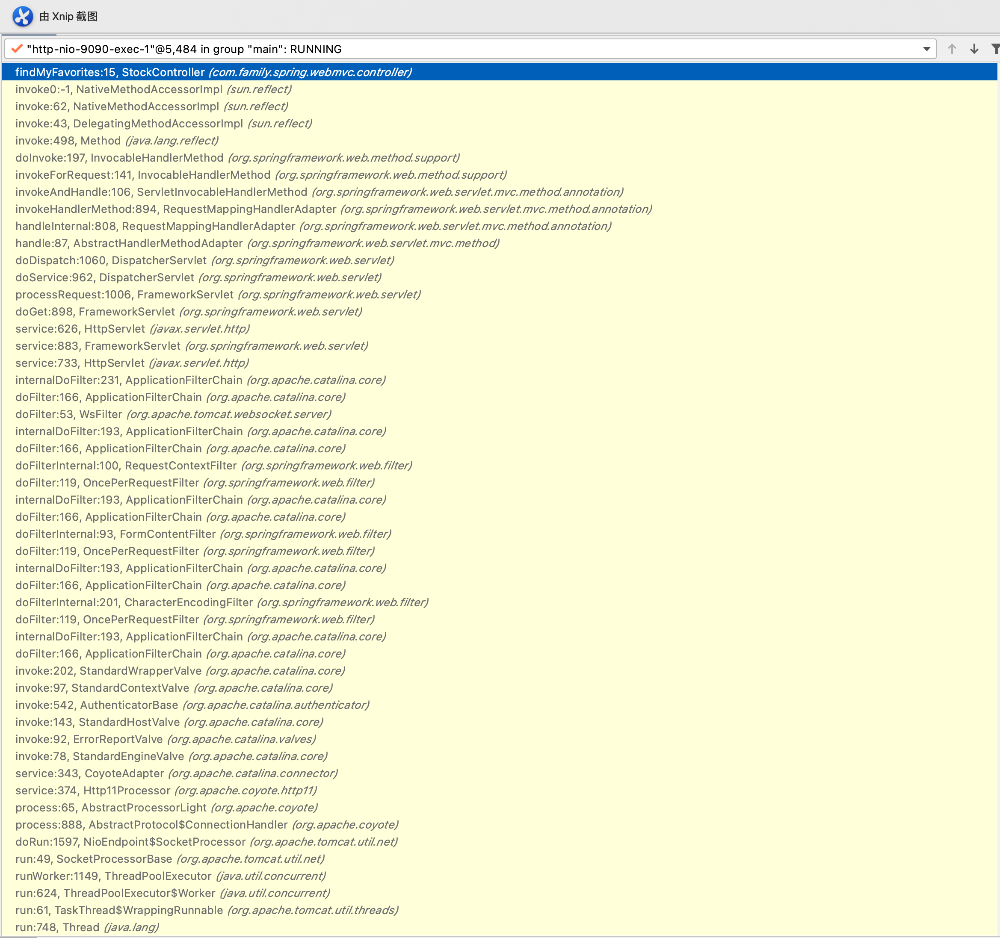

额... 是不是特别的长！不急，我们一步步解析，抽丝剥茧。

开始是一个线程的run方法。既然是线程，那必定有一个线程池。此处不得不啰嗦一下`tomcat`的线程模型了。例子中我使用的是`spring boot2.4.2`截止发稿前的官方最新稳定版本。使用的是`tomcat 9.0`，那么问题来了，tomcat是如何启动的？tomcat启动了哪些线程分别是干了什么？首先看下tomcat是如何启动的。在spring容器启动的时候，如果是`starter-web`，加载的是`ServletWebServerApplicationContext`，这个类的`createWebServer`会注册一个单例`bean` `WebServerStartStopLifecycle` ，它的`start`方法会启动`webServer`，默认是`TomcatWebServer`。它的`start`方法里，`StandardService`会添加`server.port`这个端口的连接，并且启动它。而这个连接的`start`方法里，名为`Http11NioProtocol`的协议处理器会去初始化线程。
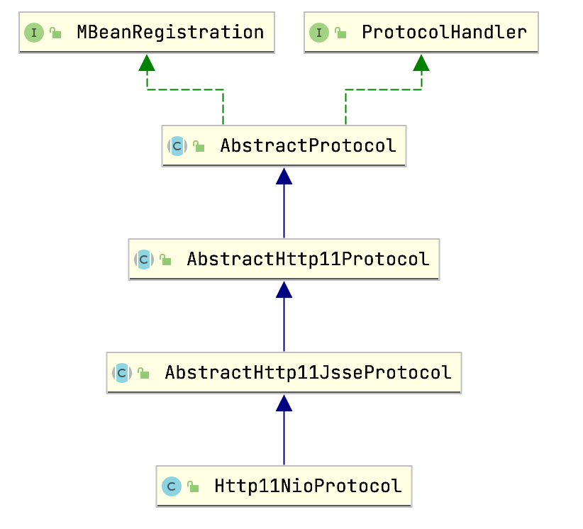

```java
// 来自 NioEndpoint 的startInternal方法
if (getExecutor() == null) {
    createExecutor();
}

initializeConnectionLatch();

// Start poller thread
poller = new Poller();
Thread pollerThread = new Thread(poller, getName() + "-ClientPoller");
pollerThread.setPriority(threadPriority);
pollerThread.setDaemon(true);
pollerThread.start();

startAcceptorThread();
```

`createExecutor`创建工作线程池。`corePoolSize`是10，最大个数是200，keepAliveTime是60秒。

`poller`线程，这个线程的run方法就是就是轮询注册在`selector`上的每个`SelectionKey`

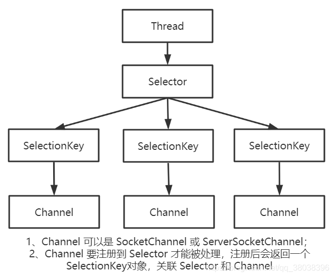

然后逐个进行处理，由于本机是mac环境，此处的`selector`对象名为：`KQueueSelectorImpl`是mac os下的nio实现。当我使用`postman`发送一个请求时。需要处理的`SelectionKey`感兴趣的事件是`OP_READ`，已经就绪的事件也是`OP_READ`。`poller`线程封装一个`SocketProcessor`，丢给工作线程池就不管了。

那`AcceptorThread`线程干啥的呢。我们看下这个线程的`run`方法。实际就是调用`ServerSocketChannel`的`accept`方法啦。

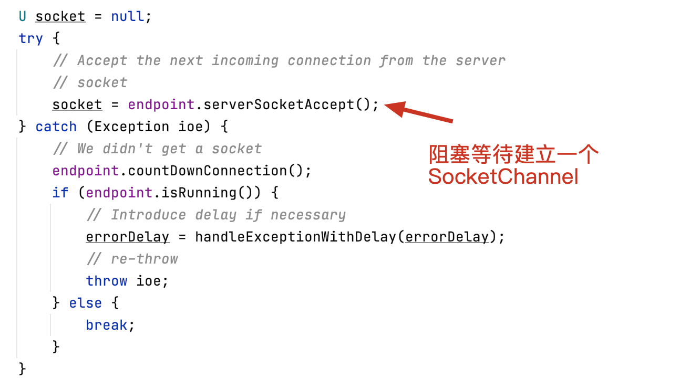

当客户端发起请求时。返回一个`SocketChannel`，然后调用`setSocketOptions`配置`socket`，注意这句

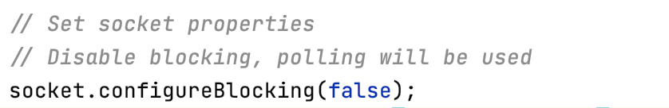

配置成非阻塞的，这样`poller`线程就可以工作了。当然最重要的就是执行了`poller.register`方法，生成了一个`PollerEvent`，`poller`线程会去处理这个事件。如果是注册`event`，实际是执行了`SocketChannel`的`register`，将`selector`和`SocketChannel`建立关联。

说了这么多想必读着对tomcat的线程模型和这些线程之间是如何协作的已经有了一个很清楚的了解了。总结下来就是tomcat也是使用的`java nio`，一个`Accept`线程负责`等待和接收客户端连接`，`poller`线程负责获取就绪的`SelectionKey`，交给工作线程，工作线程执行真正的业务逻辑。

既然上面那个长长的调用栈的源头我们说清楚了，那么就开始逐步讲解怎么走到我们的`controller`的吧。

`DispatcherServlet` 无疑是`spring mvc`的最重要的角色了。那么他是什么时候生成的呢。它是单例的吗？`DispatcherServletAutoConfiguration`给了我们答案。这个位于`spring-boot自动配置`模块的自动配置类，一旦检测到`classpath`中包含`DispatcherServlet`这个类，就会往spring容器中注册一个`DispatcherServlet`的bean。并且是单例的。

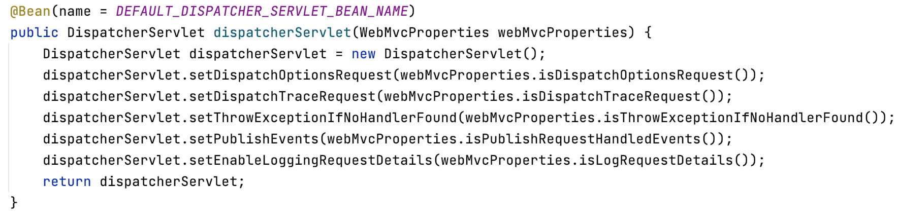

既然这个类已经到了`spring`容器了，那么他和tomcat容器又是如何整合了的呢，下面我结合`embed-tomcat-9.0`源码，绘制了一张tomcat工作类图。

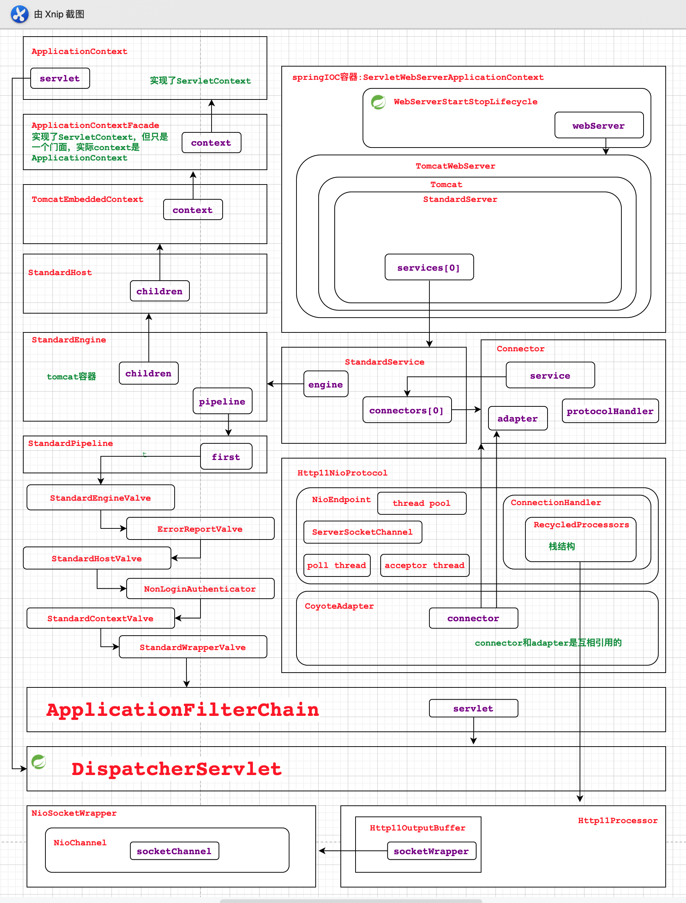

`TomcatWebServer`启动的时候会把`DispatcherServlet`添加`ServletContext` 这个`servlet`容器里面。结合这个类图，我们就可以大概了解了这个内嵌的`tomcat`服务器是如何工作的了。当我们的`ApplicationFilterChain`调用

```java
servlet.service(request, response);
```

剩下的工作也就随之交给了`DispatcherServlet`。而之前长长的调用栈。也变得非常简单。

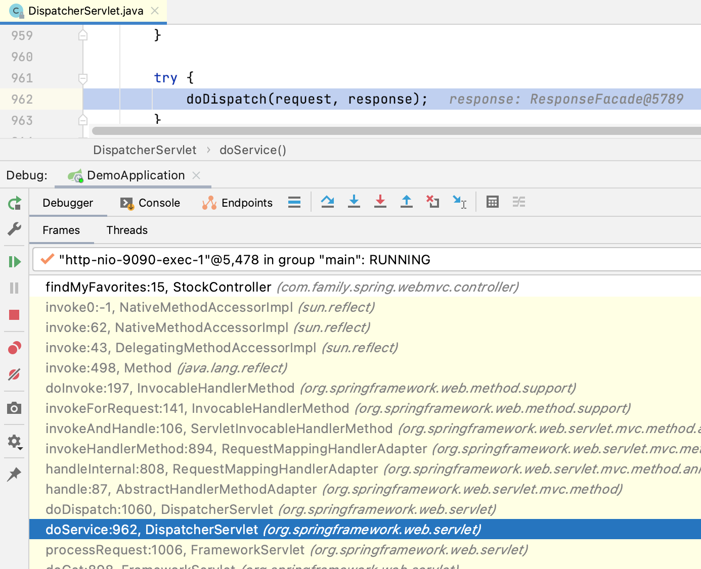

对照下源码，我们首先看下获取请求的`handler`

遍历`handlerMappings`，调用每个`mapping`的`getHandler`方法，找到了`RequestMappingHandlerMapping` 拿到`handler`返回。`RequestMappingHandlerMapping`在`WebMvcConfigurationSupport`中创建。实现了接口InitializingBean，在bean加载完成后会自动调用`afterPropertiesSet`方法，在此方法中调用了`initHandlerMethods()`来实现初始化，`RequestMappingHandlerMapping`是在`DispatcherServlet` `onRefresh`的阶段进行添加进去的。

简单解读下`initHandlerMethods`

1. 扫描所有除了`ScopedProxy`的`bean`
2. 通过是否有`Controller`或者`RequestMapping`注解判断是否是`Handler`，所以不用`@Controller`注解也是有机会注册`Handler`的。
3. 检查是否有`HandlerMethod`，如果有，注册到`mappingRegistry`
4. 判断是否是`handlerMethod`是通过`AnnotatedElementUtils.findMergedAnnotation(element, RequestMapping.class);`有没有进行判断的。

我们再来看看与`RequestMappingHandlerMapping`对应的`RequestMappingHandlerAdapter`，这个实例也是在`WebMvcConfigurationSupport`中创建的。`DispatcherServlet`的`onRefresh`阶段添加进去的。它的`afterPropertiesSet`方法初始化了所需的`argumentResolvers`和`returnValueHandlers`

下面以一个简单的例子说明`ArgumentResolver`的工作流程。

```java
@GetMapping("/xxxx")
public void xxxx(LocalDate birthday) {
    //do something      
}
```

上面这个例子中，我想要用`birthday`接受一个日期类型参数。如果不添加额外配置请求会报错。报错位置如下：

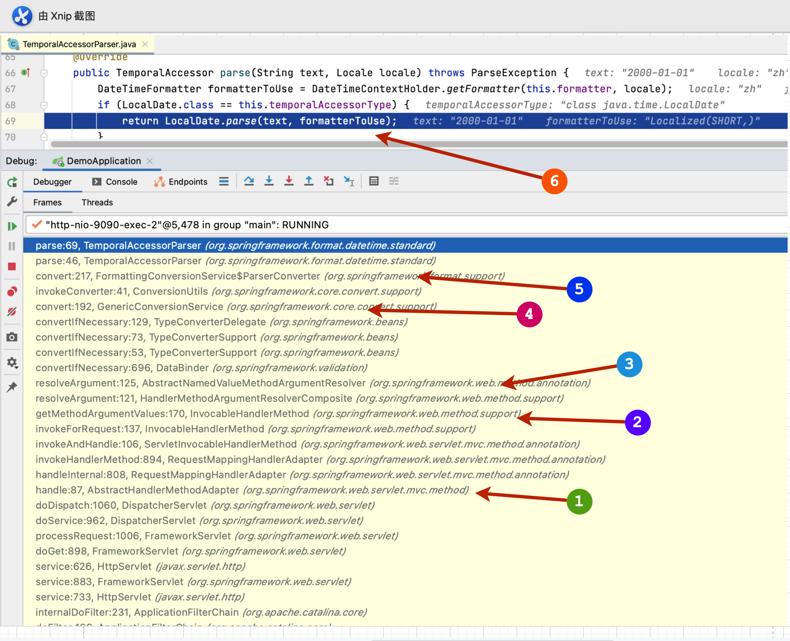

1. 调用`Adapter`的`handle`方法。

2. `HandlerMethod` 的`invoke`之前获取方法参数。

3. 循环每个参数，获取相应的`ArgumentResolver` 此处匹配到的是`RequestParamMethodArgumentResolver`，匹配原因详见它的`supportsParameter`方法。主要是因为`birthday`的类型是`LocalDate`属于简单类型。拿到`resolver`，然后就把工作交给`WebDataBinder`进行数据绑定了。

4. 调用`conversionService`进行转换

5. 根据原类型和目标类型获取`converter` 进行转换

6. 解析失败。抛出`DateTimeParseException`。

那怎么解决呢，答案是替换日期类型的格式化器。

```java
@Configuration
public class WebConfiguration implements WebMvcConfigurer {
    @Override
    public void addFormatters(FormatterRegistry registry) {
        DateTimeFormatterRegistrar registrar = new DateTimeFormatterRegistrar();
        registrar.setDateFormatter(DateTimeFormatter.ISO_DATE);
        registrar.setTimeFormatter(DateTimeFormatter.ISO_TIME);
        registrar.setDateTimeFormatter(DateTimeFormatter.ofPattern("yyyy-MM-dd HH:mm:ss"));
        registrar.registerFormatters(registry);
    }
}
```

这样配置实际上是修改`WebConversionService`这个`bean`的`formatter`

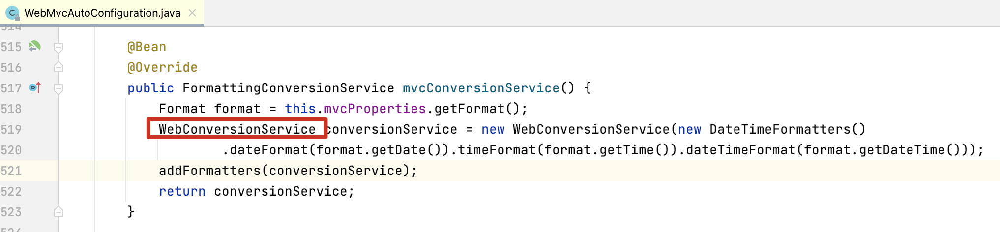

那么这个`WebConversionService`到底是不是上面转换过程中用到的`conversionService`呢。答案当然是的。我们看下定义`RequestMappingHandlerAdapter`的地方。早早的就把这个`转换服务`给塞到`数据绑定初始化器`里去了。

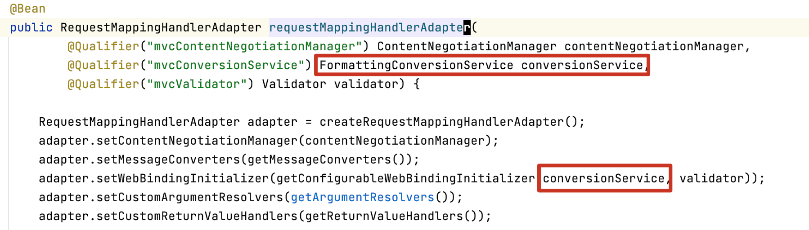

`RequestParamMethodArgumentResolver`说完了，下面再来简单介绍下`RequestResponseBodyMethodProcessor`

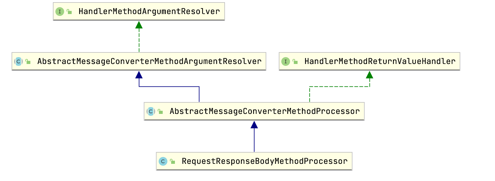

它不仅是`ArgumentResolver`，也是`ReturnValueHandler`。我们先说下它的`ArgumentResolver`功能。
```java
@PostMapping("/new-stock")
public void saveStock(@RequestBody Stock stock) {
		System.out.println("保存stock");
}
```
使用`@RequestBody`接受参数。debug发现。它的`ArgumentResolver`是`RequestResponseBodyMethodProcessor`它的判断逻辑很简单：

```java
parameter.hasParameterAnnotation(RequestBody.class)
```

核心方法`resolveArgument`调用父类`AbstractMessageConverterMethodArgumentResolver`的`readWithMessageConverters`，遍历`messageConverters`，根据http 的`content-type`匹配到的`converter`是`MappingJackson2HttpMessageConverter`。这些`messageConverters`都是在创建`RequestMappingHandlerAdapter`的时候初始化的。

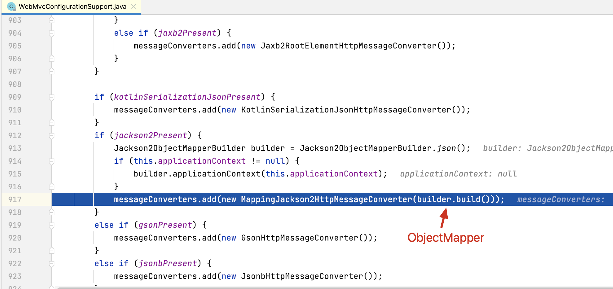

处理返回值的套路和处理参数的套路很像，都是从一堆的处理器里面找到一个合适的。如果是`ResponseBody`那么匹配的就是`RequestResponseBodyMethodProcessor`，处理返回值的核心方法是`handleReturnValue`，调用父类的`writeWithMessageConverters`，仍然是根据`mediaType`选中`MappingJackson2HttpMessageConverter`。进行序列化。并往输出流中写入。最终调用`Http11OutputBuffer`中的`socketWrapper`的`write`方法进行nio的写入。下面通过写入的调用栈分析下具体的流程。

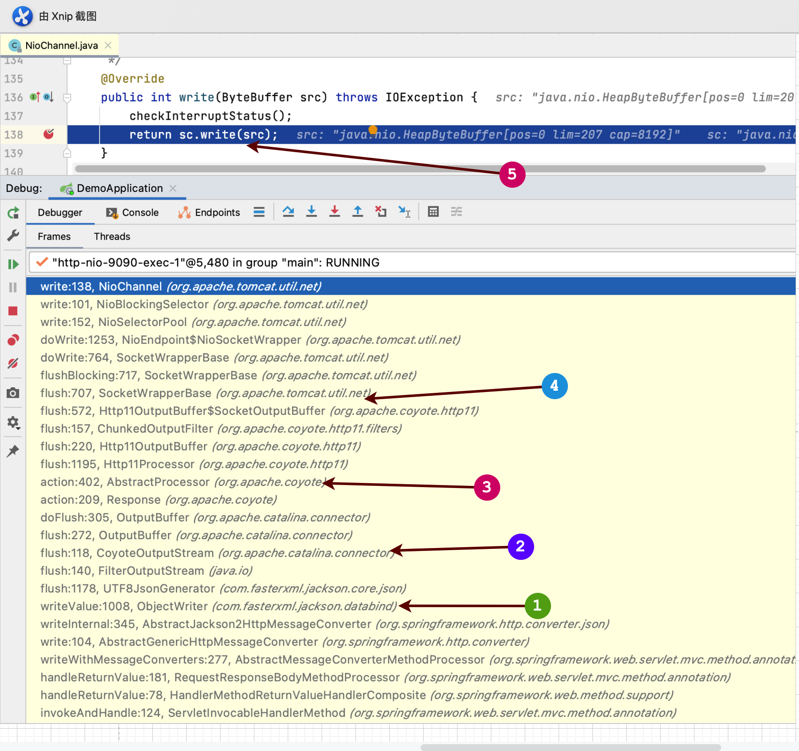

1. jackson向输出流写入数据
2. 调用tomcat封装的输出流执行`flush`进行写入
3. `response`持有`processor`的引用是通过一个叫`ActionHook`的接口进行的。
4. 调用`processor`的`outputBuffer`的`socketWrapper`进行冲刷
5. 调用`socketWrapper`封装的`socketChannel`进行真正的回写。

#### 总结

本篇文章结合了`tomcat` 和`spring mvc`的源码详细的解释了整个`rest请求`的全过程。因为涉及到的代码非常多，所以看上去有点凌乱。读者在阅读的时候可以结合源码细细推敲。从中可以吸取`tomcat源码`和`spring源码`的精华。
