<div style="text-align:left">
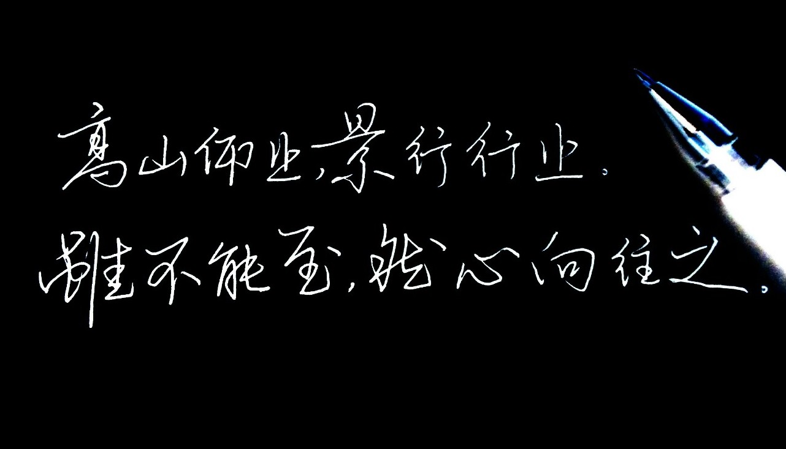
</div>
### 前言

大家好，我是拂风，一个在编程之路上的苦行僧。如果把编程和武功进行类比的话，那么算法无疑就是内力了，如果一个人的招式很多，但是内力不行，那么在比拼的时候往往战不了几个回合。好比面试的时候被人穷追不舍的追问，就露怯了。那么既然算法如此重要，那必然就得好好学习了。借此文记录学习AVL树的点滴。

### AVL树是怎样长成的?
#### 回顾一下什么是二叉树
很简单就是一颗每个节点都最多只有两个孩子的树。
> In computer science, a binary tree is a tree data structure in which each node has at most two children, which are referred to as the left child and the right child.  
>
> 在计算机系统里，二叉树是一个最多有两个孩子，一个是左孩子，一个是右孩子的树结构。
>
> 来自维基百科

#### 回顾一下什么是二叉搜索树。
英文名是binary search tree 简称BST。**1960发明的**

> In computer science, a binary search tree (BST), also called an ordered or sorted binary tree, is a rooted binary tree whose internal nodes each store a key greater than all the keys in the node's left subtree and less than those in its right subtree.
>
> 在计算机系统里，二叉搜索树也被称为有序或者排序的二叉树，每一个节点的key都大于左子树的所有key，小于右子树的所有key
>
> 来自维基百科

根据维基百科的说法，那么二叉搜索树是没有一个重复的key，所以他本质上是一个set，所以以后谁和你说BST 根小于等于右子树之类的话，可以喷他了。哈哈。BST的插入很简单，从根开始递归插入就可以。代码如下：

```java
void insert(int key){
    if(root == null){
        root = new Node(key);
        return;
    }
    insert(root,key);
}
void insert(Node node,int key){
    if(key <  node.key){
       if(node.left==null){
          node.left = new Node(key);              
       }else{
          insert(node.left,key);
       }
    }else{
      if(node.right==null){
          node.right= new Node(key);
      }else{
          insert(node.right,key);
      }
    }
}
```

BST的遍历可分为前序遍历，中序遍历，后序遍历。我是这样记忆的。前中后代表的是输出时中间节点的位置。比如先输出左子树，然后是中间节点，然后是右子树，那么就是中序遍历。另外根据BST的特性，中序遍历的结果就是一个从小到大的序列。BST的遍历同样可以使用递归的方式实现。代码如下：

```java
//中序遍历
void print(){
   print(root);
}
void print(Node node){
   if(node.left != null){
     print(node.left);
   }
   System.out.print(node.key);
   if(node.right != null){
      print(node.right);
   }
}
```
#### AVL树闪亮登场
好的，前菜介绍完了，下面该介绍今天的主角了，AVL树。完美平衡二叉搜索树，为什么要发明这种树呢？因为二叉搜索树对树的高度没有进行限定。比如依次插入[1,2,3,4,5]，生成的树结构是这样的。这不就是一个单项链表吗。此时他的搜索最差时间复杂度已经变成`O(n)`了。
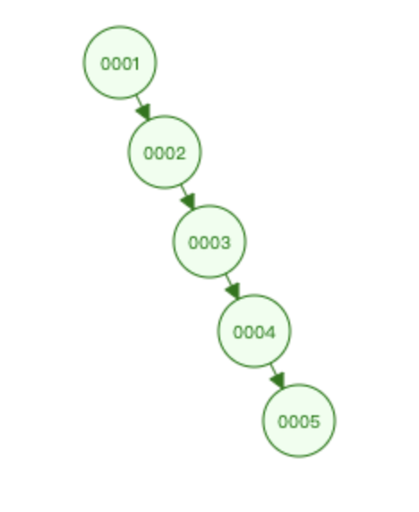
所以AVL树在二叉搜索树的基础上，加入了如下规则：**每个节点的左子树和右子树的高度最多差1** 上面的树变成了下面这样，这样他的算法复杂度最差的情况下也是O(log n)，感叹前辈发明的伟大。上面的链表就变成了下面的树结构
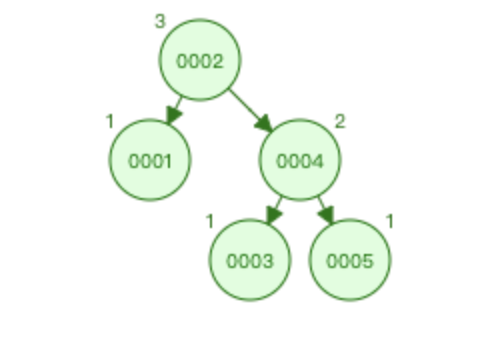

#### 关于树的高度
> 树的高度或深度：树中结点的最大层次
> 来自百度百科

所以高度是针对树而言的，没有树就没有高度的概念。另外节点也是没有高度的这种属性的。但在AVL树变成中我们通常给节点定义一个属性`height`，此处表示的意思其实是这个节点作为根节点的子树的高度的意思。上图中的AVL树其实已经给每个节点标记了高度了。

#### 关于O(logn)的复杂度

> 算法中log级别的时间复杂度都是由于使用了分治思想,这个底数直接由分治的复杂度决定。
如果采用二分法,那么就会以2为底数,三分法就会以3为底数,其他亦然。
不过无论底数是什么,log级别的渐进意义是一样的。
也就是说该算法的时间复杂度的增长与处理数据多少的增长的关系是一样的。
> 来自技术大佬的解答：https://blog.csdn.net/jdbc/article/details/42173751

比如采用2分法那么就是 $log_2n$ 当n=8 $log_2n$=3，也就是说集合个数如果是8，那么我查找一个数最多会进行3次比较。

### AVL树的旋转
构造一个平衡的二叉搜索树不是一件容易的事情。每一次插入都可能会造成树的不平衡。需要进行变换重新获得平衡。经典的做法有右旋和左旋。然后又分左左，右右，左右，右左四种情况。在我看来，并不是那么容易理解。下面介绍一个网友的万能大法。对于任何一次变换，规则都是一样的。
#### 万能套路
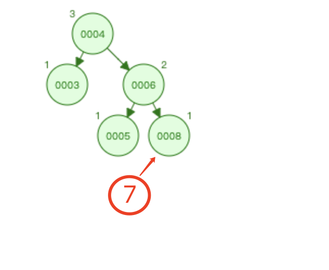

* 首先找到不平衡子树的根节点4（4的左子树高度是1，右子树高度是3，不满足）
* 找出4到新插入节点7的路径(7除外)是`4->6->8`，以中间的6为新的根节点，构建子树
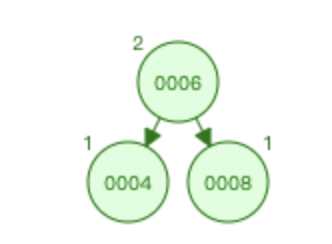
* 其他节点逐个补上即可，3补到4的左边，5补到4的右边，7补到8的右边。
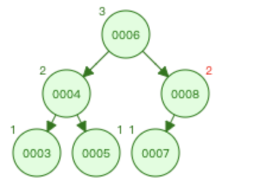
* 旋转完成 so easy

#### 四种变换

假设不平衡子树的根节点为a

| 插入方式 | 描述                                                  | 旋转方式     |
| -------- | ----------------------------------------------------- | ------------ |
| LL       | 在a的**左子树**根节点的**左子树**上插入节点而破坏平衡 | 右旋转       |
| RR       | 在a的**右子树**根节点的**右子树**上插入节点而破坏平衡 | 左旋转       |
| LR       | 在a的**左子树**根节点的**右子树**上插入节点而破坏平衡 | 先左旋后右旋 |
| RL       | 在a的**右子树**根节点的**左子树**上插入节点而破坏平衡 | 先右旋后左旋 |

1. 左左：可以分为三个步骤：第一步：中间变量指向节点2，第二步：3的左方向指向2R，第三步：中间变量的右方向指向3，此处必须有个中间变量因为，如果直接进入第二步，那么后面就找不到2了，因为没有谁指向2了。所有的转换都是类似的操作。

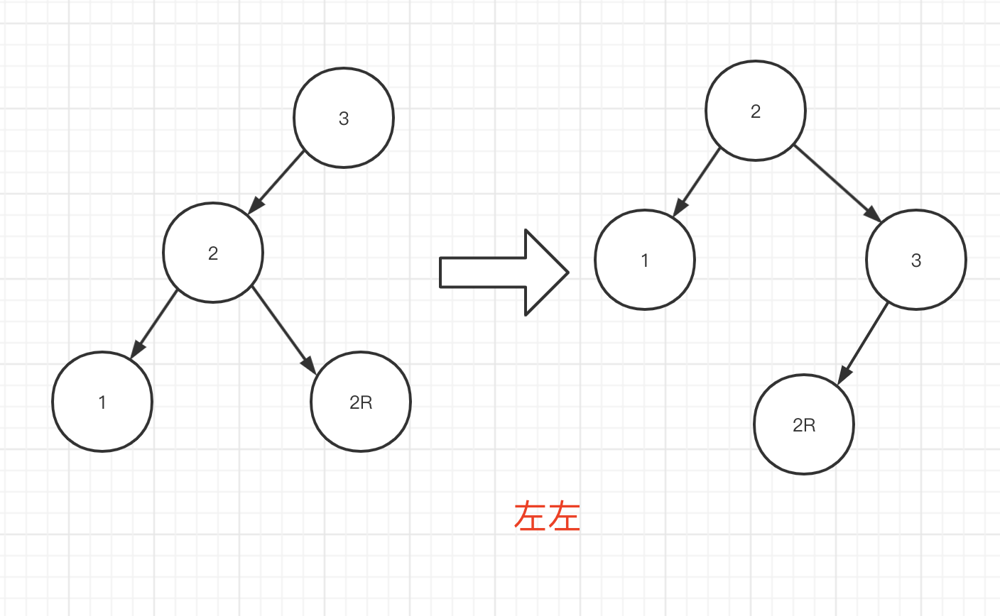

2. 右右：可以分三个步骤：第一步：中间变量指向节点2，第二步：1的右方向指向2L，第三步：中间变量的左方向指向1。

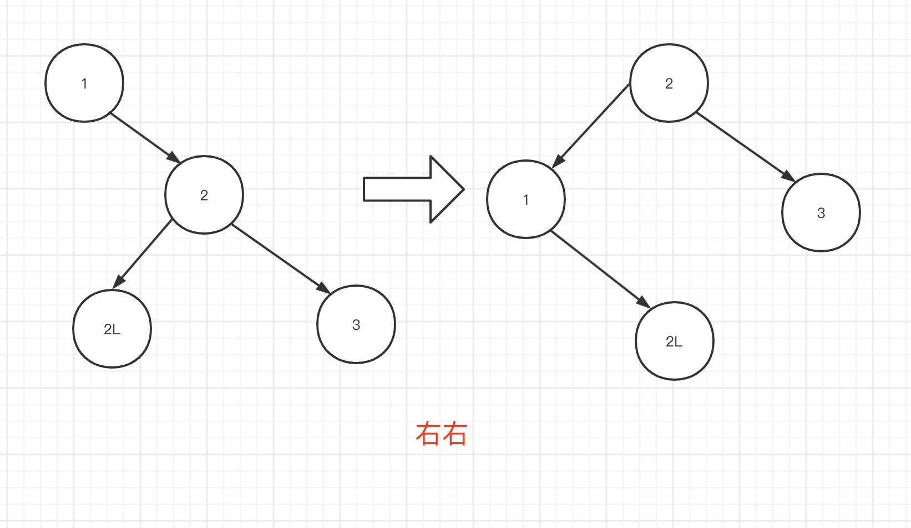

3. 左右

   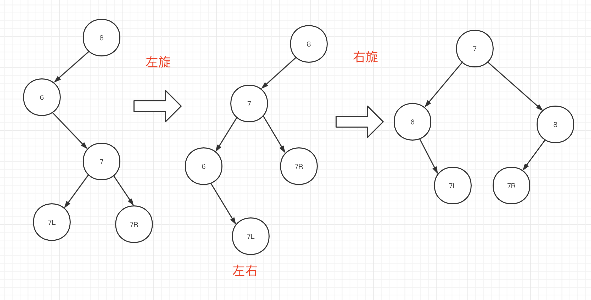


4. 右左
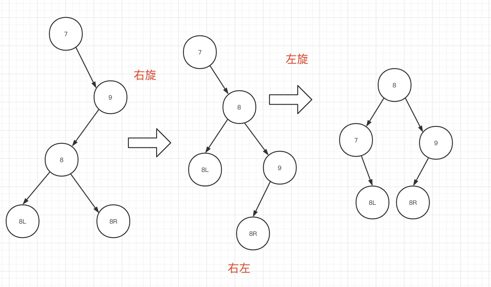

理解起来也不费事。翻译为代码，如下

```java
int height(Node node){
  if(node =null){
    return 0;
  }
  return node.height;
}
//当发现一个子树不平衡时,传入不平衡子树的根节点,返回新的根节点
Node rebalance(Node root){
  Node node1,node2;
  //LL
  if(height(root.left) > right(root.right) && height(root.left.left) > height(root.left.right)){
    node1 = node.left;
    node.left = node1.right;
    node1.right = node;
    refreshHeight(node);//此处不用刷新node1是因为调用rebalance后会对根节点进行刷新
    return node1; //返回新的根节点
  }
  //LR
  if(height(root.left) > right(root.right) && height(root.left.left) < height(root.left.right)){
    node1 = node.left;
    node2 = node.left.right;
    node.left = node2.right;
    node1.right = node2.left;
    node2.left = node1;
    node2.right = node;

    refreshHeight(node);
    refreshHeight(node1);
  }
  //RR
  if(height(root.left) < right(root.right) && height(root.right.left) < height(root.right.right)){
    node1 = node.right;
    node.right = node1.left;
    node1.left = node;
    refreshHeight(node);
    return node1;
  }
  //RL
  if (height(node.right) > height(node.left) &&
                    height(node.right.left) > height(node.right.right)) {
     node1 = node.right;
     node2 = node.right.left;
     node.right = node2.left;
     node1.left = node2.right;
     node2.left = node;
     node2.right = node1;

     refreshHeight(node);
     refreshHeight(node1);
     return node2;
   }
   return node;
}

void refreshHeight(Node node){
  node.height = Math.max(height(node.left), height(node.right)) + 1;
}

//传入树的根节点, 要插入的值，返回新的根节点
Node insert(Node node,int key){
  if(key==node.key){
    return node;
  }
  if(key < node.key){
     if(node.left == null){
       node.left = new Node(key);
     }else{
       node.left = insert(node.left,key);       
     }
  }else{
     if(node.right == null){
       node.right = new Node(key);
     }else{
       node.right = insert(node.right,key);
     }
  }
  if(Math.abs(height(node.left)-height(node.left))>1){
     node = rebalance(node);
  }
  refreshHeight(node);
  return node;
}
```

### 小结

AVL树是一颗自平衡的二叉树。为什么要自平衡，其实就是为了更好了实现分治思想。保证整个集合尽量符合二分查找的基本思想。这样就能达到神奇的$log_2n$的复杂度了。不管是AVL树还是BST，不管是插入还是遍历，代码都大量使用了递归的写法。递归的写法和分治的思想是密不可分的。

### 实战
说了这么多，来道简单的算法题练练手吧。
> 输入一棵二叉树的根节点，判断该树是不是平衡二叉树。如果某二叉树中任意节点的左右子树的深度相差不超过1，那么它就是一棵平衡二叉树。
> 摘自【剑指 Offer 】55 难度系数：简单

#### 解题思路

题目意思就是判断一颗二叉树是不是平衡的。很简单，采用分治思想，首先判断左子树的高度和右子树的高度相差是否不超过1，如果满足条件，再判断左子树是否是一颗平衡二叉树，右子树是否是一个平衡二叉树。最终就是判断一个空节点是不是一个平衡二叉树。代码如下：

```java
public boolean isBalanced(TreeNode root) {
        if (root == null) {
            return true;
        }
        if (Math.abs(height(root.left) - height(root.right)) <= 1) {
            return isBalanced(root.left) && isBalanced(root.right);
        }
        return false;
}
public static int height(TreeNode root) {
        if (root == null) {
            //空节点
            return 0;
        }
        return Integer.max(height(root.left), height(root.right)) + 1;
}
```

> 输入某二叉树的前序遍历和中序遍历的结果，请重建该二叉树。假设输入的前序遍历和中序遍历的结果中都不含重复的数字。
>
> 摘自【剑指 Offer 】07 难度系数：中等

#### 解题思路

首先根据前序遍历和中序遍历的特性，很容易想到的一个解题思路就是用递归的方法逐层构建二叉树。代码如下：

```java
public TreeNode buildTree(int[] preorder, int[] inorder) {
        if(preorder.length==0){
            return null;
        }
        int root = preorder[0];
        TreeNode rootNode = new TreeNode(preorder[0]);
        for (int i = 0; i < inorder.length; i++) {
            if (inorder[i] == root) {
                if (i > 0) {
                    int[] newLeftPreorder = new int[i];
                    int[] newLeftInorder = new int[i];
                    System.arraycopy(preorder, 1, newLeftPreorder, 0, i);
                    System.arraycopy(inorder, 0, newLeftInorder, 0, i);
                    rootNode.left = buildTree(newLeftPreorder, newLeftInorder);
                }
                int rightLength = inorder.length - i - 1;
                if (rightLength > 0) {
                    int[] newRightPreorder = new int[rightLength];
                    int[] newRightInorder = new int[rightLength];
                    System.arraycopy(preorder, i + 1, newRightPreorder, 0, rightLength);
                    System.arraycopy(inorder, i + 1, newRightInorder, 0, rightLength);
                    rootNode.right = buildTree(newRightPreorder, newRightInorder);
                }
                return rootNode;
            }
        }
        return rootNode;
    }
```

> 

很遗憾，虽然正确性没问题，但是性能极差。

优化后代码：

```java
public TreeNode buildTree(List<Integer> preorder, List<Integer> inorder) {
        if (preorder.size() == 0) {
            return null;
        }
        int root = preorder.get(0);
        TreeNode rootNode = new TreeNode(root);
        int i = inorder.indexOf(root);
        if (i > 0) {
            rootNode.left = buildTree(preorder.subList(1, 1 + i), inorder.subList(0, i));
        }
        int rightLength = inorder.size() - i - 1;
        if (rightLength > 0) {
            rootNode.right = buildTree(preorder.subList(i + 1, inorder.size()), inorder.subList(i + 1, inorder.size()));
        }
        return rootNode;
    }

    public TreeNode buildTree(int[] preorder, int[] inorder) {
        return buildTree(Arrays.stream(preorder).boxed().collect(Collectors.toList()), Arrays.stream(inorder).boxed().collect(Collectors.toList()));
    }
```

> 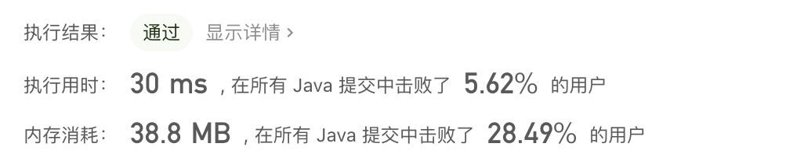

成效甚微！主要原因分析大概率还是因为查找下标的过程太耗时了。忍不住看了下官方的递归题解，思路是一样的，不同的是记录了一下索引位置。然后大量使用偏移量去做。代码感觉还是比较丑陋的。另外官方还给出了一个非常巧妙的迭代法。详见官方解题思路分析。

### 附录

* BST 树演示地址：https://www.cs.usfca.edu/~galles/visualization/BST.html
* AVL树演示地址：https://www.cs.usfca.edu/~galles/visualization/AVLtree.html