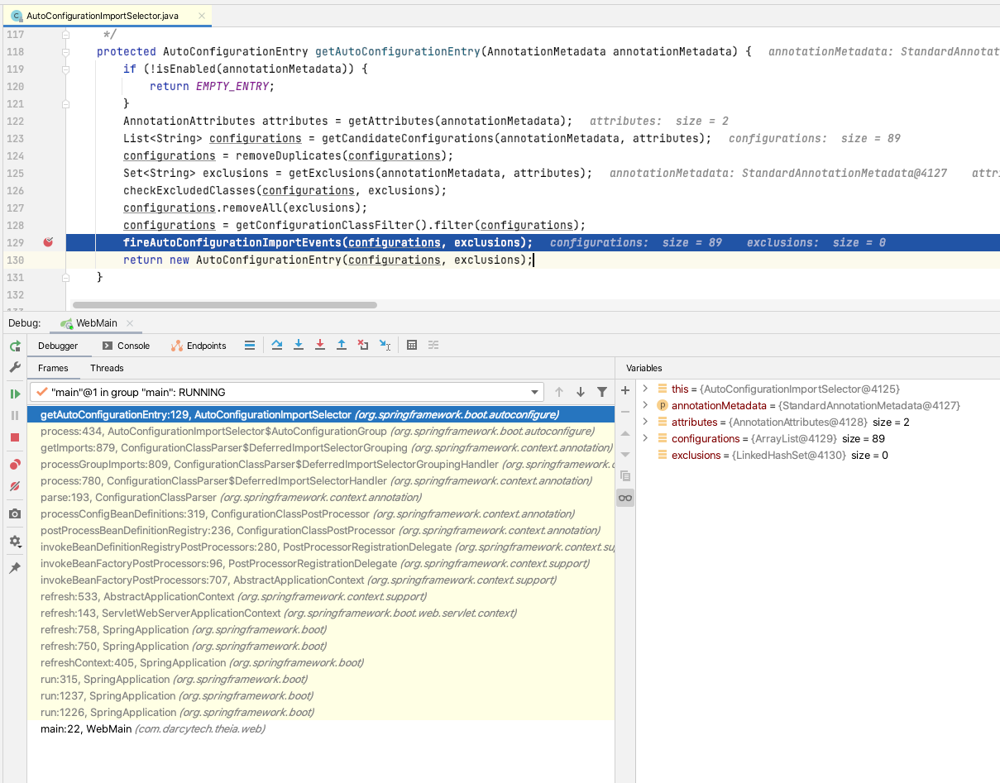

### 前言
自动配置是spring-boot一个非常重要的特点，比如创建一个web应用,只需要写一个main class打上`@SpringBootApplication`的注解，然后pom文件里引入依赖即可
```xml
<dependency>
	<groupId>org.springframework.boot</groupId>
	<artifactId>spring-boot-starter-web</artifactId>
</dependency>
```
相比传统的`j2ee`应用，大大的精简了配置，但对于开发者来说，也隐藏了许多细节，只关心怎么使用是远远不够的。这篇文章我就和读者一起探究spring boot是如何实现自动配置的。

### SpringBootApplication



1. `SpringApplication#refreshContext` 刷新`ApplicationContext` 叫容器或者bean工厂都可以
2. `AbstractApplicationContext#invokeBeanFactoryPostProcessors` 
3. `PostProcessorRegistrationDelegate#invokeBeanDefinitionRegistryPostProcessors` 进行`BeanDefinition`注册,此时的`processor`就是`ConfigurationClassPostProcessor`
4. `ConfigurationClassPostProcessor#postProcessBeanDefinitionRegistry`