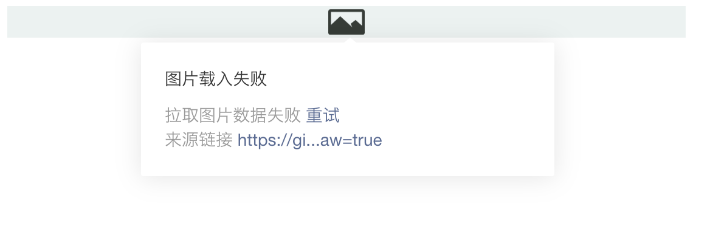
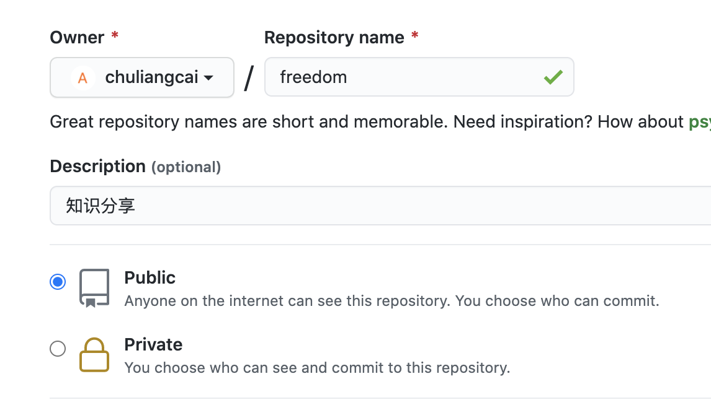
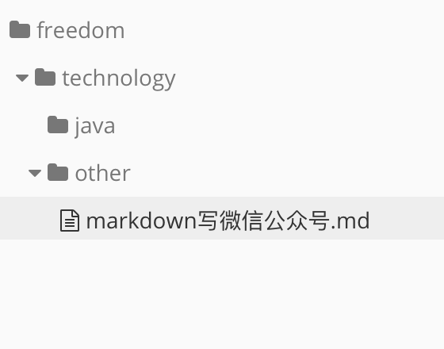
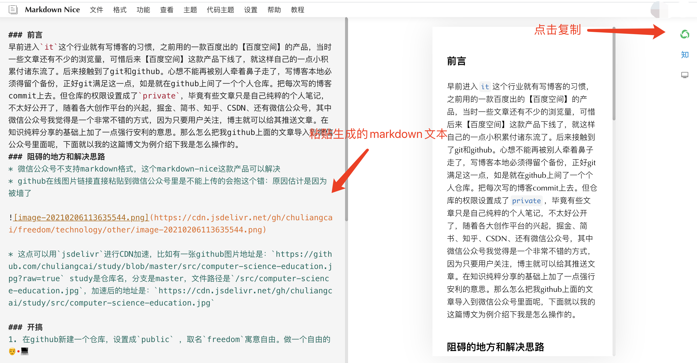
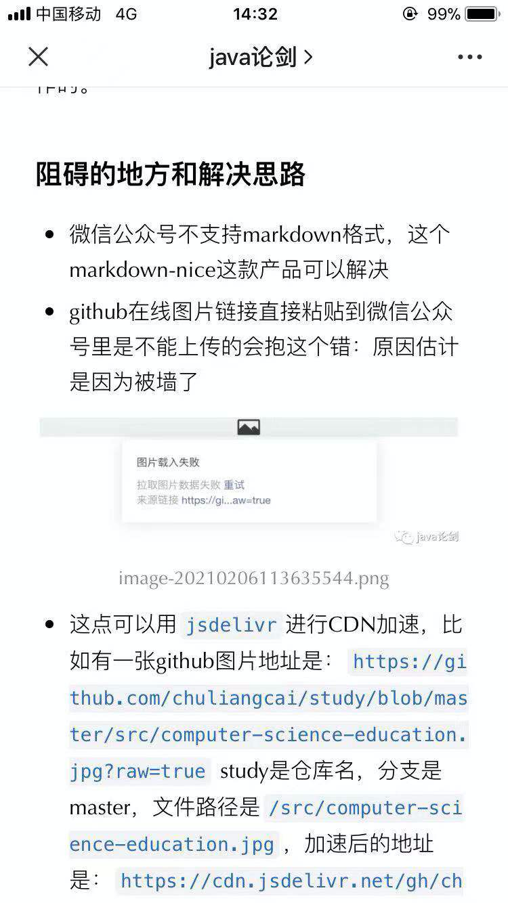

### 前言
早前进入`it`这个行业就有写博客的习惯，之前用的一款百度出的【百度空间】的产品，当时一些文章还有不少的浏览量，可惜后来【百度空间】这款产品下线了，就这样自己的一点小积累付诸东流了。后来接触到了git和github。心想不能再被别人牵着鼻子走了，写博客本地必须得留个备份，正好git满足这一点，如是就在github上间了一个个人仓库。把每次写的博客commit上去。但仓库的权限设置成了`private`，毕竟有些文章只是自己纯粹的个人笔记，不太好公开了，随着各大创作平台的兴起，掘金、简书、知乎、CSDN、还有微信公众号，其中微信公众号我觉得是一个非常不错的方式，因为只要用户关注，博主就可以给其推送文章。在知识纯粹分享的基础上加了一点强行安利的意思。那么怎么把我github上面的文章导入到微信公众号里面呢，下面就以我的这篇博文为例介绍下我是怎么操作的。
### 阻碍的地方和解决思路
* 微信公众号不支持markdown格式，这个markdown-nice这款产品可以解决
* github在线图片链接直接粘贴到微信公众号里是不能上传的会抱这个错：原因估计是因为被墙了



* 这点可以用`jsdelivr`进行CDN加速，比如有一张github图片地址是：`https://github.com/chuliangcai/study/blob/master/src/computer-science-education.jpg?raw=true` study是仓库名，分支是master，文件路径是`/src/computer-science-education.jpg`，加速后的地址是：`https://cdn.jsdelivr.net/gh/chuliangcai/study/src/computer-science-education.jpg`

### 开搞
1. 在github新建一个仓库，设置成`public` ，取名`freedom`寓意自由。做一个自由的👨‍💻



2. 使用`git clone https://github.com/chuliangcai/freedom.git` 将仓库下载到本地
3. 使用`typora` 打开`freedom`文件夹，创建好目录

 

4. 提交文章`git push`
5. 编写java代码将文章中的图片全部转换为jsdelivr的路径，代码如下

```java
public class RegexDemo {

    public static final String OUTPUT_PATH = "/Users/chuliangcai/Desktop/markdown写微信公众号.md";
    public static final Pattern PATTERN = Pattern.compile("!\\[image-\\d{17}]\\(image-\\d{17}\\.png\\)");
    public static final String IMAGE_PATH_PREFIX = "https://cdn.jsdelivr.net/gh/chuliangcai/freedom/technology/other/";

    public static void main(String[] args) throws Exception {
        FileInputStream fis = new FileInputStream("/Users/chuliangcai/data/projects/freedom/technology/other/markdown写微信公众号.md");
        BufferedReader br = new BufferedReader(new InputStreamReader(fis));
        BufferedWriter bw = new BufferedWriter(new OutputStreamWriter(new FileOutputStream(OUTPUT_PATH)));
        String str;
        while ((str = br.readLine()) != null) {
            Matcher matcher = PATTERN.matcher(str);
            if (matcher.find()) {
                String image = matcher.group();
                String fileName = StringUtils.substringBetween(image, "(", ")");
                String replaced = str.replace(image, "");
                bw.write(replaced + "\n");
            } else {
                bw.write(str + "\n");
            }
        }
        br.close();
        bw.flush();
        bw.close();
    }
}
```
5. 进入`markdown nice`官网注册账户
6. 将刚才的输出内容拷贝到markdown编辑区域



7. 进入微信公众号后台，新建图文素材，粘贴刚才的内容。

8. 最终手机效果如下，效果满分！



### 附录

jsdelivr 网站地址：https://www.jsdelivr.com/?docs=gh
markdown-nick官网：https://www.mdnice.com/